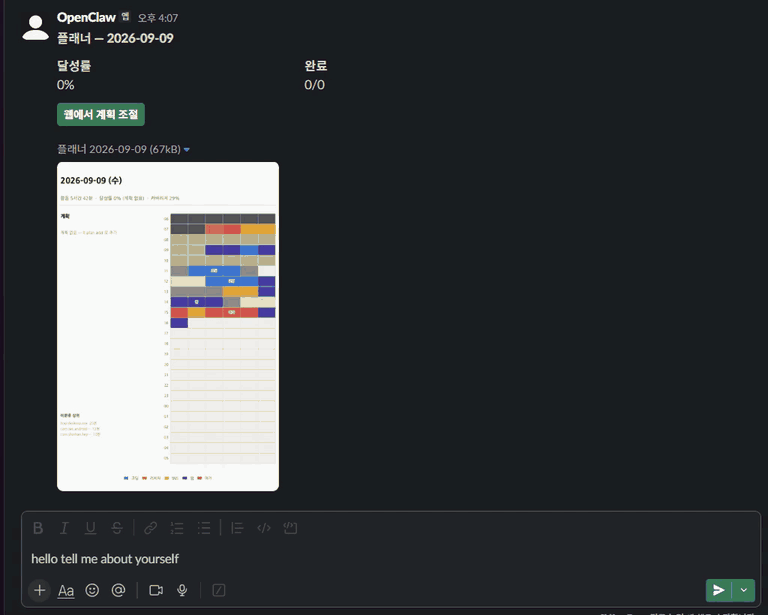
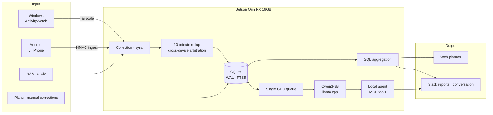
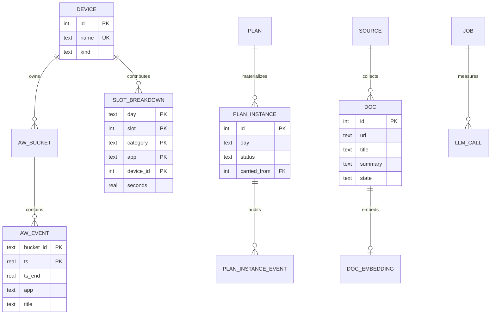

# Project Jetson

[한국어](README.md)

**An always-on, on-device personal agent built on a Jetson Orin NX 16GB. It selects
its model based on measurements, organizes PC and phone activity into 10-minute
intervals, and answers questions using the user's own records as evidence.**

This project did not choose a model from specification sheets alone. I measured
memory, power, context-depth performance, and tool calling on the actual board,
selected an operating configuration, and built [Life Trainer](life-trainer/) on top
of it for daily use.



> **Local agent conversation demo (4× speed)** — Qwen3-8B on the Jetson uses tools
> to retrieve actual activity and plan data before answering. Playback is four
> times faster than the original.
> [Watch the original video (MP4, 4 min 41 sec)](docs/images/jetson-running.mp4)

---

## What I built

| Component | Role | Result |
|---|---|---|
| **Jetson Measurement Suite** | Measured generation performance across 13 model/quantization configurations, then compared three finalists at increasing context depths and on tool calling | Selected Qwen3-8B for production |
| **Life Trainer** | Collects laptop and phone activity and combines it into 10-minute intervals | Web planner and daily/weekly reports |
| **Local Agent** | Retrieves activity, plans, and documents through tools and answers from evidence | Qwen3-8B + MCP tools + Slack |
| **Operations & Safety** | Reboot recovery, health checks, backups, privacy checks, and link validation | Always-on systemd operation and reproducible checks |

The important part is not the four components in isolation, but the way they form
one system: **measure → select → build → operate**.


> **Life Trainer example** — Plans, laptop and phone activity, and a 10-minute
> timetable are shown together. The records visible here are approved for public use.

---

## End-to-end workflow



Raw activity and aggregated data stay in SQLite on the Jetson. External integrations
such as Slack, search, and feeds are used only when explicitly configured. Search
queries pass through a privacy egress check immediately before transmission.

→ [Full workflow and agent boundaries](life-trainer/docs/architecture.md#2-워크플로우)

---

## Core data model

The current schema contains 31 ordinary tables, one FTS5 table, and one view. This
top-level diagram shows only the real foreign-key relationships and the entities
needed to understand the system.



The data is separated by meaning:

- `aw_event`: raw machine-collected events
- `slot_breakdown`: second-level evidence by category, app, and device
- `slot`: one representative activity displayed for each 10-minute interval
- `plan_instance`: what the user intended to do
- `slot_override`: a user correction to the recorded activity

`slot`, `plan_instance`, and `slot_override` describe the same day, but they are
deliberately not merged into a single fact. **Measured facts, human intent, and human
corrections are different kinds of data.**

→ [Actual schema](life-trainer/lifetrainer/schema.sql)

---

## Design principles

### 1. Aggregate with SQL; use the LLM only for language

Deterministic code and SQL calculate activity duration, completion rates, and device
shares. The LLM explains those computed values and is not invoked when no supported
data path can supply them.

### 2. Keep plans separate from observed activity

The database and prompts both keep these layers separate, preventing the agent from
claiming a planned task was completed or mistaking observed activity for a plan.

### 3. Treat the GPU as one shared resource

The 8B server uses about 6.7GB, so conversation, summarization, and tagging do not run
concurrently. A single queue and process lock serialize the work, and interactive
conversation takes priority over nightly batches.

### 4. Let the model choose what to do, not how much or how far it may reach

The agent selects tools, while tools perform arithmetic and file access is confined
to approved directories. Strings leaving the device are checked again at the actual
transmission boundary.

---

## Production configuration chosen by measurement

| Question | Measured result | Decision |
|---|---|---|
| Is the factory configuration sufficient? | Only 4 GPU SMs enabled | Enable all 8 SMs with MAXN |
| Which model? | Qwen3-8B scored 6/6 on tool calling and held up better at deep context | Qwen3-8B Q4_K_M |
| How much context? | At 40,960 tokens, KV cache used 2.99GB | Reduce to 20,480 and recover 1.50GB |
| How many concurrent requests? | KV cache grows with the number of slots | One slot |
| Short-generation benchmark? | `llama-bench tg128` reached 11.14 tok/s; measured VDD_IN peaked at 20.4W | Adopt as the production model |

The 30B MoE was faster in a shallow benchmark, but **the 8B model overtook it at
9,603 tokens**. Agent conversations accumulate context, so performance by context
depth mattered more than a single short prompt.


The inference server, KV cache, CPU embedding model, gateway, and Python services fit
within 13.4GB.


> Values use the [measurement environment snapshot](environment.md). Live memory
> usage, including the current desktop session, may differ.

<details>
<summary><b>Tokens per watt by model</b></summary>


The 8B model was selected for tool-calling accuracy and context-depth performance,
not for the highest efficiency score.

</details>

→ [Model comparison](measure/findings/llm-models.md) ·
[Performance analysis](measure/findings/performance.md) ·
[Runtime configuration](operate/notes/llm-runtime.md)

---

## Known limitations

- **This is the result from one board.** Even another Orin NX may produce different
  numbers with a different power mode, JetPack version, cooling setup, or background load.
- **Not all 13 configurations received the same deep-context and tool tests.** The
  13-configuration suite centered on short `llama-bench` runs; detailed context-depth,
  Korean-language, and tool-calling comparisons covered only three finalists.
- **The 6/6 tool-calling result comes from a small fixed test.** It does not guarantee
  perfect accuracy on arbitrary real-world requests.
- **Sustained MAXN load testing remains.** Current power and temperature values were
  observed during benchmarks lasting only a few minutes, not a long thermal-stability run.
- **Always-on operation is not an SLA.** systemd restarts the services after reboot,
  but no uptime or long-term availability figure has been established.
- **The RAG scope is title, abstract, and summary.** Full-document retrieval and
  chunking are intentionally outside the implementation scope.
- **Privacy checks are a pattern-based safety net.** They catch known formats and
  tracked files, but do not replace a security audit or final human review.

→ [Remaining measurements](measure/findings/performance.md#10-미검증-항목) ·
[Current status and pending work](life-trainer/HANDOFF.md)

---

## Production operation

- Life Trainer web, sync, worker, and Slack services run continuously under systemd.
- `desired-state.txt` is the source of truth for detecting differences between the
  intended installation and actual runtime state.
- Health checks verify that the expected model ID responds, not merely that a port is open.
- GPU work is serialized, with interactive conversations taking priority.
- Backups, restore bundles, and scheduled health checks are maintained together.
- Links, documentation metrics, static analysis, tests, and privacy are checked before push.

```bash
make status        # Current services and configuration
make check-fast    # Links, docs, shell, lint, and privacy
make check         # Full test suite included
make check-privacy # Personal browsing records and sensitive files
```

Failures are recorded not only as code changes but as one document per broken
assumption in [HISTORY](life-trainer/HISTORY/).

---

## Try it with sample activity data

You can run the complete post-collection pipeline without ActivityWatch or any real
personal data.

```bash
cd life-trainer
python3 -m venv .venv
.venv/bin/pip install -e .

.venv/bin/lt init-db
.venv/bin/lt synth --days 14
.venv/bin/lt rollup --range 2026-08-02 2026-08-15
.venv/bin/lt stats --day 2026-08-15
.venv/bin/lt report daily --day 2026-08-15
```

The `lt report` command sends nothing to Slack unless `--post` is explicitly supplied.
For real PC/phone connections and always-on service installation, follow the
[Life Trainer README](life-trainer/README.md#빠른-시작--샘플-활동-데이터로-5분-만에-결과-확인하기).

---

## Privacy and public scope

- Real activity databases, browsing records, window titles, authentication tokens,
  and personal configuration are excluded from Git.
- Public documentation uses generated sample data or screenshots explicitly approved
  for publication.
- Activity records are stored in local SQLite.
- External search sends only the required query and runs a privacy-pattern check
  immediately before transmission. This blocks requests that explicitly ask to search
  personal records, but it cannot stop every path by which the model might reuse a
  term found in those records as a search query
  ([known limitation](life-trainer/docs/issues/0031-the-model-can-put-a-record-in-the-query.md)).
- `make check-privacy` checks tracked files and documentation again before publication.
- These checks detect known patterns; they do not replace human review before release.

---

## Documentation map

| Question | Document |
|---|---|
| What is running now? | [HANDOFF](life-trainer/HANDOFF.md) |
| How do I install and use Life Trainer? | [Life Trainer README](life-trainer/README.md) |
| What are the full features and pipeline? | [Handbook](life-trainer/docs/handbook.md) |
| What are the ERD, workflow, and design decisions? | [Architecture](life-trainer/docs/architecture.md) |
| Where are the model and performance measurements? | [Measure](measure/) |
| How is the Jetson operated continuously? | [Operate](operate/) |
| What assumptions failed, and how are regressions prevented? | [HISTORY](life-trainer/HISTORY/) |
| Where is the Android collection app? | [LT Phone](https://github.com/donghee-ai/LT-Phone) |

---

## Environment

```text
Hardware    Jetson Orin NX 16GB / Ampere 1024 CUDA / Cortex-A78AE ×8 / LPDDR5 128-bit
Software    JetPack 6.2.3 / L4T 36.5.0 / CUDA 12.6 / TensorRT 10.3 / Ubuntu 22.04
Inference   llama.cpp / Qwen3-8B Q4_K_M / ctx 20480 / one slot
Power mode  MAXN
```

See [environment.md](environment.md) for exact measurement conditions and
[measure/](measure/) for reproduction commands.

## License

This repository does not currently declare a separate license. External reference
projects and model weights remain subject to their respective authors' licenses.
Add a `LICENSE` file if reuse terms need to be made explicit.
