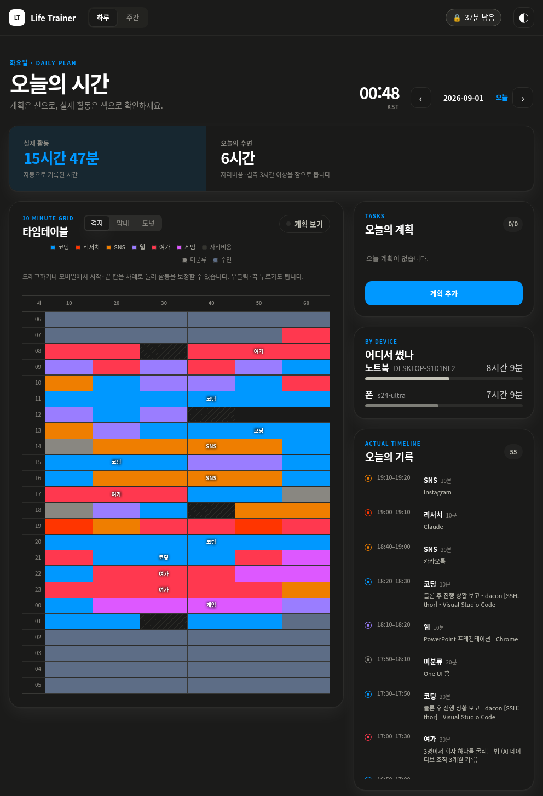
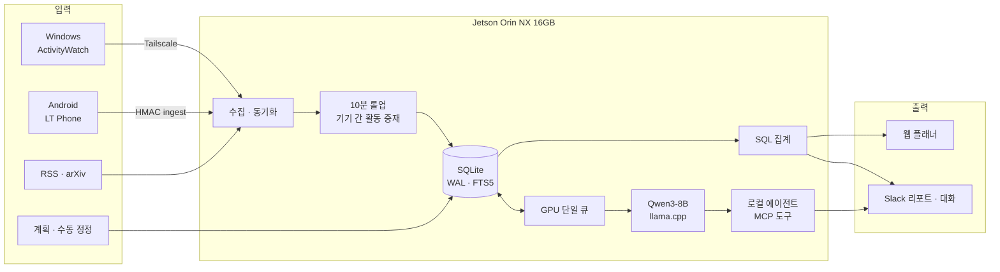
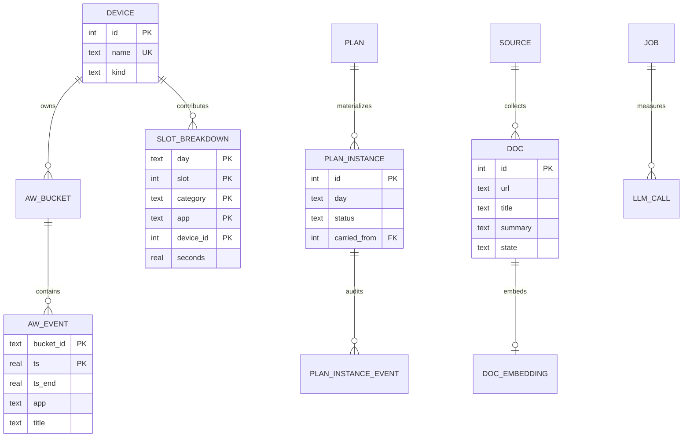
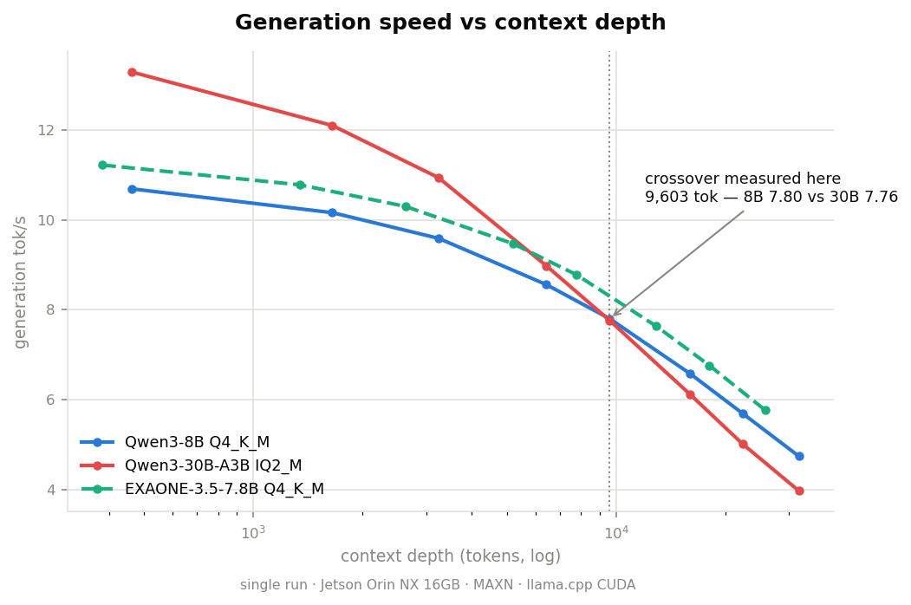
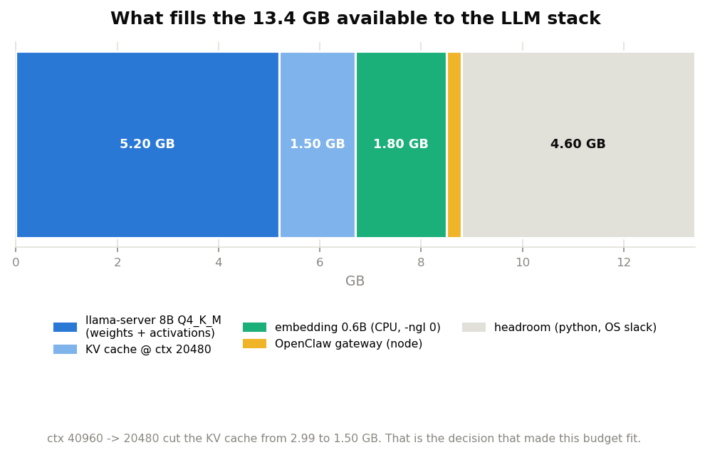
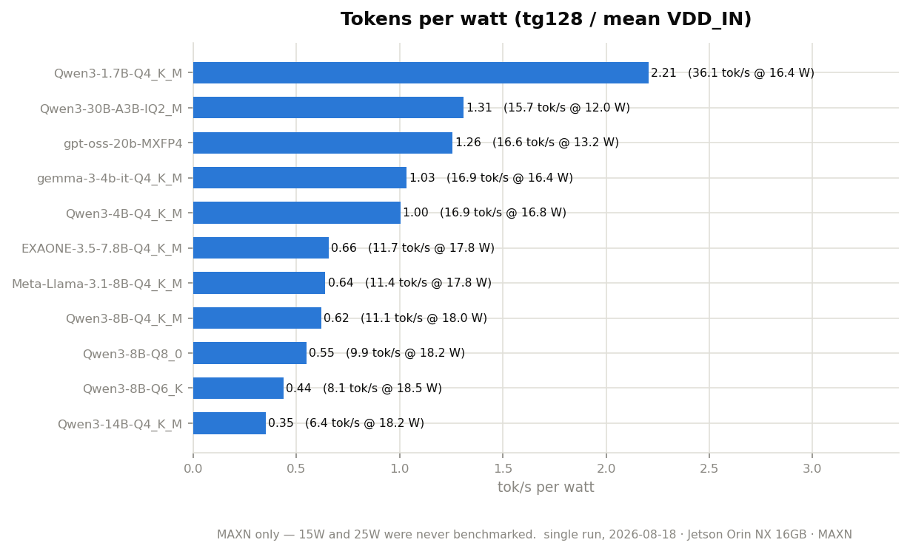

# Project Jetson

**Jetson Orin NX 16GB에서 모델을 직접 고르고, PC·폰 활동을 10분 단위로 정리하며,
자기 기록에 근거해 답하도록 만든 상시 실행형 온디바이스 개인 에이전트.**

사양표만 보고 모델을 올리지 않았다. 실제 보드에서 메모리·전력·컨텍스트 깊이·툴 콜링을
측정해 운영 구성을 정했고, 그 위에 [Life Trainer](life-trainer/)를 만들어 실사용하고 있다.



> **Life Trainer 예시 화면** — 계획, 노트북·폰 활동, 10분 단위 타임테이블을 한 화면에 모은다.
> 화면에 보이는 기록은 공개용으로 승인된 예시다.

---

## 무엇을 만들었나

| 구성요소 | 역할 | 결과 |
|---|---|---|
| **Jetson Measurement Suite** | 13개 모델·양자화 구성의 생성 성능 실측, 후보 3종 깊이·툴 콜링 비교 | Qwen3-8B 운영 구성 결정 |
| **Life Trainer** | 노트북과 폰의 활동을 수집해 10분 단위로 통합 | 웹 플래너·일일/주간 리포트 |
| **Local Agent** | 활동·계획·문서를 도구로 조회하고 근거 기반 응답 | Qwen3-8B + MCP 도구 + Slack |
| **Operations & Safety** | 재부팅 복구, 상태 점검, 백업, 개인정보·링크 검사 | systemd 상시 운영과 재현 가능한 검사 |

핵심은 네 부분을 따로 만든 것이 아니라, **측정 → 선택 → 구현 → 운영**을 한 시스템으로
연결했다는 데 있다.

---

## 전체 워크플로



활동 원본과 집계 데이터는 Jetson의 SQLite에 둔다. Slack·검색·피드 같은 외부 연동은
명시적으로 설정한 경우에만 사용하며, 검색 경로에는 전송 직전 개인정보 출구 검사를 둔다.

→ [전체 워크플로와 에이전트 경계](life-trainer/docs/architecture.md#2-워크플로우)

---

## 핵심 데이터 모델

현재 스키마는 일반 테이블 31개, FTS5 테이블 1개와 뷰 1개다. 루트에서는 실제 외래키 관계와
시스템을 이해하는 데 필요한 엔터티만 보인다.



데이터는 의미에 따라 분리한다.

- `aw_event`: 기계가 수집한 원본
- `slot_breakdown`: 카테고리·앱·기기별 초 단위 집계 근거
- `slot`: 화면에 표시할 10분 칸의 대표 활동 하나
- `plan_instance`: 사람이 하려고 한 일
- `slot_override`: 사람이 실제 기록을 바로잡은 값

`slot`, `plan_instance`, `slot_override`는 같은 하루를 설명하지만 의도적으로 하나의 사실처럼
합치지 않는다. **측정된 사실, 사람의 의도, 사람의 정정은 서로 다른 데이터다.**

→ [계층별 전체 ERD와 설계 근거](life-trainer/docs/architecture.md#1-erd) ·
[실제 스키마](life-trainer/lifetrainer/schema.sql)

---

## 설계를 결정한 원칙

### 1. 집계는 SQL, 문장화만 LLM

활동 시간·달성률·기기별 비중은 결정적 코드와 SQL이 계산한다. LLM은 계산된 값을 인용해
설명하고, 데이터에 닿을 방법이 없으면 호출하지 않는다.

### 2. 계획과 실제 활동을 섞지 않는다

계획만 보고 “완료했다”고 답하거나, 실제 활동을 계획으로 오해하지 않도록 DB와 프롬프트
양쪽에서 두 계층을 분리한다.

### 3. GPU는 하나의 자원이다

8B 서버가 약 6.7GB를 사용하므로 대화·요약·태깅을 동시에 실행하지 않는다. 하나의 큐와
프로세스 락으로 직렬화하고, 사람의 대화 턴이 야간 배치보다 먼저 처리된다.

### 4. 모델에게 무엇을 할지는 맡겨도, 얼마인지와 어디까지인지는 맡기지 않는다

에이전트는 도구를 선택하지만 산술은 도구가 하고, 파일 접근은 지정된 폴더에 가둔다.
외부로 나가는 문자열은 실제 전송 지점에서 다시 검사한다.

---

## 실측으로 정한 운영 구성

| 질문 | 실측 결과 | 결정 |
|---|---|---|
| 출고 상태로 충분한가 | GPU 4 SM만 활성 | MAXN으로 8 SM 활성 |
| 어떤 모델인가 | Qwen3-8B 툴 콜링 6/6, 깊은 컨텍스트에서 유리 | Qwen3-8B Q4_K_M |
| 컨텍스트는 얼마인가 | 40,960에서 KV 캐시 2.99GB | 20,480으로 낮춰 1.50GB 확보 |
| 동시에 몇 요청인가 | 슬롯 수만큼 KV 캐시가 증가 | 슬롯 1개 |
| 짧은 생성 벤치 결과는 | `llama-bench tg128` 11.14 tok/s, 측정 중 VDD_IN 최대 20.4W | 운영 모델로 채택 |

얕은 벤치마크에서는 30B MoE가 빨랐지만, **9,603 토큰에서 8B가 추월했다.** 에이전트는
대화가 누적되므로 단일 짧은 프롬프트보다 깊이별 성능이 더 중요한 선택 기준이었다.



13.4GB 안에 추론 서버, KV 캐시, CPU 임베딩, 게이트웨이와 파이썬 서비스를 함께 넣었다.



> 수치는 [측정 환경 스냅숏](environment.md) 기준이다. 현재 데스크톱 세션을 포함한 실시간
> 메모리 사용량과는 차이가 날 수 있다.

<details>
<summary><b>모델별 와트당 성능 보기</b></summary>



8B를 고른 이유는 최고 효율이 아니라 툴 콜링 정확도와 깊이별 성능이다.

</details>

→ [모델 비교](measure/findings/llm-models.md) ·
[성능 분석](measure/findings/performance.md) ·
[런타임 운영 설정](operate/notes/llm-runtime.md)

---

## 확인된 한계

- **보드 한 대의 결과다.** 같은 Orin NX라도 전력 모드·JetPack·냉각·백그라운드 부하가
  다르면 수치가 그대로 재현된다고 보장할 수 없다.
- **13종 모두를 같은 깊이와 툴 시험으로 비교한 것은 아니다.** 13종 스위트는 짧은
  `llama-bench`가 중심이고, 깊이·한국어·툴 콜링 상세 비교는 후보 3종에 한정된다.
- **툴 콜링 6/6은 작은 고정 시험의 결과다.** 임의의 실제 요청에서 100% 정확하다는 뜻이 아니다.
- **MAXN 지속 부하 검증이 남아 있다.** 현재 전력·온도 값은 수 분 이내의 벤치마크에서
  관측한 값이며 장시간 열 안정성 시험 결과가 아니다.
- **상시 실행은 SLA가 아니다.** 서비스는 systemd에 활성화되어 재기동되지만 무중단률이나
  장기 가용성 수치를 산출하지 않았다.
- **RAG 범위가 제한적이다.** 현재 색인은 제목·초록 중심이며, 문서 본문 저장과 청킹은
  완료되지 않았다.
- **개인정보 검사는 패턴 기반 안전망이다.** 알려진 형태와 추적 파일을 잡지만 보안 감사나
  사람의 최종 공개 검토를 대체하지 않는다.

→ [남은 측정 항목](measure/findings/performance.md#10-미검증-항목) ·
[현재 상태와 대기 작업](life-trainer/HANDOFF.md)

---

## 실제 운영

- Life Trainer 웹·동기화·워커·Slack 서비스를 systemd로 상시 운영한다.
- `desired-state.txt`를 정본으로 삼아 설치 상태와 실제 실행 상태의 차이를 검사한다.
- 포트가 열렸는지만 보지 않고, 기대한 모델 ID가 실제로 응답하는지 확인한다.
- GPU 작업은 직렬화하고 대화 요청에 우선권을 준다.
- 백업·복구 번들과 정기 상태 점검을 함께 둔다.
- 링크·문서 수치·정적 분석·테스트·개인정보 검사를 push 전에 실행한다.

```bash
make status        # 현재 서비스·설정 상태
make check-fast    # 링크·문서·셸·린트·개인정보
make check         # 전체 테스트 포함
make check-privacy # 개인 열람 기록과 민감 파일 검사
```

실패는 수정된 코드만 남기지 않고, **어떤 가정이 깨졌는지**를
[HISTORY](life-trainer/HISTORY/)에 한 사건당 한 문서로 기록한다.

---

## 합성 데이터로 확인하기

ActivityWatch나 실제 개인 데이터 없이 수집 이후의 전체 파이프라인을 실행할 수 있다.

```bash
cd life-trainer
python3 -m venv .venv
.venv/bin/pip install -e .

.venv/bin/lt init-db
.venv/bin/lt synth --days 14
.venv/bin/lt rollup --range 2026-08-02 2026-08-15
.venv/bin/lt stats --day 2026-08-15
.venv/bin/lt report daily --day 2026-08-15
```

위의 `lt report` 명령은 `--post`를 명시했을 때만 Slack으로 발송된다. 실제 PC·폰 연결과 상시 서비스 설치는
[Life Trainer README](life-trainer/README.md#빠른-시작--합성-데이터로-5분-안에-결과-보기)를 따른다.

---

## 개인정보와 공개 범위

- 실제 활동 DB, 방문 기록, 창 제목, 인증 토큰과 개인 설정은 Git에서 제외한다.
- 공개 문서에는 합성 데이터 또는 명시적으로 공개 승인된 화면만 사용한다.
- 활동 기록은 로컬 SQLite에 저장한다.
- 외부 검색에는 필요한 질의어만 보내며 전송 직전에 개인정보 패턴을 검사한다.
  이 검사는 **자기 기록을 묻는 말**을 막는 것이고, 모델이 기록에서 뽑은 낱말을
  검색어로 쓰는 경로까지 막지는 못한다 ([알려진 한계](life-trainer/docs/issues/0031-the-model-can-put-a-record-in-the-query.md)).
- 공개 전 `make check-privacy`로 추적 파일과 문서를 다시 검사한다.
- 이 검사는 알려진 패턴을 찾는 보조 수단이며, 공개 전 사람의 확인도 필요하다.

---

## 문서 지도

| 읽고 싶은 것 | 문서 |
|---|---|
| 지금 무엇이 돌고 있는가 | [HANDOFF](life-trainer/HANDOFF.md) |
| Life Trainer 설치·사용법 | [Life Trainer README](life-trainer/README.md) |
| 전체 기능과 파이프라인 | [Handbook](life-trainer/docs/handbook.md) |
| ERD·워크플로·설계 판단 | [Architecture](life-trainer/docs/architecture.md) |
| 모델·성능 실측 | [Measure](measure/) |
| Jetson 상시 운영 | [Operate](operate/) |
| 깨진 가정과 재발 방지 | [HISTORY](life-trainer/HISTORY/) |
| Android 수집 앱 | 별도 비공개 저장소 `donghee-ai/lt-phone` |

---

## 환경

```text
하드웨어   Jetson Orin NX 16GB / Ampere 1024 CUDA / Cortex-A78AE ×8 / LPDDR5 128-bit
소프트웨어 JetPack 6.2.3 / L4T 36.5.0 / CUDA 12.6 / TensorRT 10.3 / Ubuntu 22.04
추론       llama.cpp / Qwen3-8B Q4_K_M / ctx 20480 / 슬롯 1
전력모드   MAXN
```

정확한 측정 조건은 [environment.md](environment.md), 재현 명령은 [measure/](measure/)에 있다.

## 라이선스

이 저장소에는 아직 별도 라이선스를 선언하지 않았다. 외부 참고 프로젝트와 모델 가중치는
각 원저작자의 라이선스를 따른다. 재사용 조건을 명확히 하려면 `LICENSE`를 추가해야 한다.
