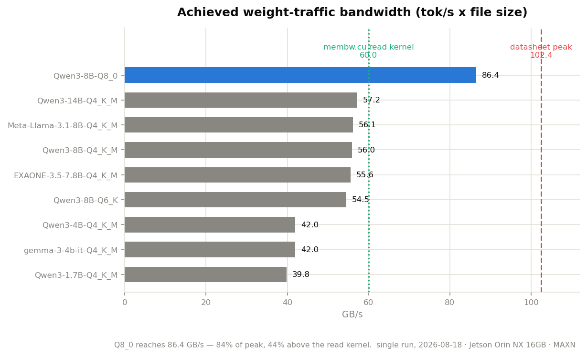

# project-jetson

**NVIDIA Jetson Orin NX 16GB (reComputer J4012) — 무엇을 올릴 수 있는지 정하려고 잰 기록**

이 기기를 받고 세 가지를 정해야 했다.

> **① 내 환경에 올라가는가 · ② 어떤 모델이 적합한가 · ③ 메모리를 얼마나 둘지**

사양서로는 셋 다 답이 안 나왔다. 그래서 직접 쟀고, 그 답 위에서
[Life Trainer](Life_Trainer/) 가 24시간 돌고 있다.

---

## ① 올라가는가

| | 사양 | 실측 |
|---|---|---|
| LLM 가용 메모리 | 16 GB | **약 13.4 GB** (통합 메모리, OS 제외) |
| GPU — 출고 15W 모드 | 1024 CUDA core | **512 (4 SM)** — TPC 절반이 게이팅돼 있었다 |
| GPU — MAXN 적용 후 | — | **1024 (8 SM) @ 918 MHz** |
| Super Mode (157 TOPS) | 지원 표기 | **사용 불가** — 디바이스 트리에 `-super` 가 없다 |

**출고 기본값에서 GPU 절반이 꺼져 있었다.** MAXN 으로 SM 이 4 → 8 이 됐다.
Super Mode 는 conf 파일이 있어도 부팅마다 되돌려지고, 하드웨어 과전류 보호도 25W 로 잡혀 있다.


> 와트당 성능은 **MAXN 에서만** 쟀다. 15W·25W 는 아직 측정하지 않았다.

→ [research/hardware.md](research/hardware.md)

---

## ② 어떤 모델이 적합한가

에이전트로 쓸 것이므로 **툴 콜링이 되는지**가 첫 관문이었고, 대화가 길어질 것이므로
**깊이에서 버티는지**가 두 번째였다.

| 모델 | 툴 콜링 | 깊이 특성 | 한국어 |
|---|---|---|---|
| **Qwen3-8B Q4_K_M** | **6/6** | 깊어질수록 유리 | — |
| Qwen3-30B-A3B IQ2_M | 4/6 | 얕은 깊이에서 가장 빠름 | — |
| EXAONE 3.5 7.8B | **미지원** — 채팅 템플릿에 `tools` 렌더링이 없다 | 전 구간 최고 속도 | 토큰 **19% 절약** |

**깊이 9,603 토큰에서 8B(7.80 tok/s)가 30B(7.76)를 추월한다.** 실측된 교차점이고,
얕은 벤치마크만 보고 모델을 고르면 안 된다는 것이 이 프로젝트의 가장 큰 교훈이다.

라이선스도 봤다 — Qwen3 계열은 Apache 2.0, EXAONE 은 `other` 다.


→ [research/llm-models.md](research/llm-models.md) · [research/performance.md](research/performance.md) · [benchmarks/](benchmarks/) (13종 실측)

---

## ③ 메모리를 얼마나 둘지

13.4 GB 안에 **추론 서버 · 임베딩 · 게이트웨이 · 파이썬**이 같이 들어가야 했다.

```
llama-server (8B Q4_K_M)   6.7 GB      ← 그중 KV 캐시 1.50 GB
임베딩 (0.6B, CPU)          1.8 GB      ← -ngl 0. GPU 에 올리면 8B 가 버퍼를 못 잡는다
OpenClaw 게이트웨이          0.3 GB
──────────────────────────────────
남는 것                     약 4.5 GB   ← 파이썬 상주 300MB 이하로 묶었다
```

**컨텍스트를 40960 → 20480 으로 낮춰 KV 를 2.99 → 1.50 GB 로 줄인 것**이 이 예산을
성립시킨 결정이다. 슬롯 수가 KV 를 배수로 잡으므로 슬롯도 1개로 뒀다.


→ [docs/build/llm-runtime.md](docs/build/llm-runtime.md)

---

## → 그래서 정한 것

```
Qwen3-8B Q4_K_M · ctx 20480 · 슬롯 1 · MAXN · Flash Attention · CUDA Graphs

llama-bench   pp512 353.7 tok/s · tg128 11.14 tok/s · VDD_IN 20.4W · tj 67°C
실사용 깊이    463 토큰 10.69 → 9,603 토큰 7.80 → 31,901 토큰 4.74 tok/s
```

이 설정 위에서 [Life Trainer](Life_Trainer/) 가 타이머 7개와 상시 서비스 3개로
재부팅을 넘겨 돌고 있다.

---

<details>
<summary><b>참고 — 메모리 대역폭은 결정 인자가 아니었다</b></summary>

처음에는 `membw.cu` 로 잰 **60.0 GB/s** 를 "사양 102.4 대비 58%" 로 읽고 성능 예측의
출발점으로 삼았다. **2026-08-18 에 모델 13종을 재면서 그 해석이 틀렸다는 게 드러났다.**

```
membw.cu 읽기 커널        60.0 GB/s
D2D 복사 (읽기+쓰기)       69.5 GB/s
Qwen3-8B Q4_K_M 트래픽    56.0 GB/s
Qwen3-8B Q8_0 트래픽      86.4 GB/s   ← 사양의 84%. 읽기 커널보다 44% 높다
```



60 GB/s 는 **단일 커널 마이크로벤치의 한계**이지 하드웨어 천장이 아니었다.
K-quant 가 55~57 에서 평평한 것은 대역폭이 아니라 **슈퍼블록 언패킹 연산 비용** 때문이고,
즉 그 구간은 메모리가 아니라 **연산에 먼저 막힌다.**

관측은 맞았고 원인 귀속이 틀렸다. 그리고 **이 숫자는 ①②③ 어느 결정도 좌우하지 않았다** —
모델 선택은 툴 콜링과 깊이가, 메모리 예산은 KV 크기가 정했다.

→ [research/performance.md](research/performance.md)

</details>

---

## 다시 돌리려면

```bash
make verify     # JetPack·CUDA·전력모드 점검 → environment.md
make bench      # 모델 벤치 무인 실행 (약 40분)
make figures    # results/ 에서 그림 재생성
make links      # 문서 링크 418개 검사
make test       # Life Trainer 테스트 (네트워크 불필요)
```

측정 환경 스냅숏은 [environment.md](environment.md) — **이 저장소의 모든 수치가
그 환경에서 나왔다.**

---

## 디렉토리 구조

**폴더가 곧 상태다.** `research/` 는 잰 것, `docs/build/` 는 돌고 있는 것,
`docs/plans/` 는 안 끝난 것, `docs/archive/` 는 접은 것.

```
├── benchmarks/          모델 13종 실측 (2026-08-18) → 색인: benchmarks/README.md
├── research/            조사 · 실측  → 색인: research/README.md
│   ├── hardware.md          하드웨어 실측 · 전력모드 · 메모리 예산
│   ├── performance.md       벤치마크 (대역폭 · 깊이별 곡선 · 품질)
│   ├── llm-models.md        모델 3종 비교 (툴콜링 · 속도 · 한국어)
│   ├── reference-survey.md  GitHub 생태계 전수 스캔 (704개)
├── docs/                구축 · 기획   → 색인: docs/README.md
│   ├── build/               ✅ 가동 중
│   │   ├── llm-runtime.md       llama.cpp 빌드 · 서버 운영
│   │   └── openclaw-agent.md    에이전트 게이트웨이 결합 · 함정 14가지
│   │                            + §7 Life Trainer 결합 (MCP · 폴더 감옥 · 예산)
│   ├── plans/               ⏳ 미완
│   │   ├── opensource-plan.md   측정 자료 공개 · whichllm 기여
│   │   └── grant-radar-plan.md  지원사업 매칭 서비스 (미착수)
│   └── archive/             ⛔ 판단 종료 · 접은 것
│       └── speech/          음성 에이전트 — 성립했지만 ASR 을 안 쓰기로 (문서+스크립트)
│       ├── project-candidates.md  후보 7개 비교
│       ├── project-proposal.md    Understudy (미채택)
│       └── vision-agent-plan.md   Frigate+VLM (전제 무효)
├── Life_Trainer/        ★ 상시 구동 중인 응용 — 자체 문서 트리를 갖는다
├── openclaw-setup/      OpenClaw 실행 자산 (systemd 유닛 · 설치 스크립트)
├── scripts/             측정 · 자동화 도구
├── results/             측정 원본 데이터
├── models/              어떤 가중치를 왜 골랐나 (실물은 `~/models/`, git 제외)
└── reference/           타 프로젝트 클론 (git 제외)
```

---

## 이 위에 올린 것 — Life Trainer

측정으로 확인한 제약(**60 GB/s · 11 tok/s · 13.4 GB**) 위에서 실제로 돌아가는 응용.

하루 활동을 10분 단위 144슬롯으로 계측하고, 야간에 관심사 문서를 수집·요약하고,
Slack 으로 리포트를 보내며, **물어보면 자기 기록을 근거로 답하는** 온디바이스 개인 에이전트.
**실사용 중** — 타이머 7개와 상시 서비스 3개가 재부팅을 넘겨 돌고 있다.

```
ActivityWatch(PC) ──Tailscale──┐
RSS · arXiv ───────────────────┼─→ SQLite(WAL·FTS5) ─→ GPU 단일 큐 ─→ Slack · 웹 플래너
수동 입력 / Slack 대화 ─────────┘                        (Qwen3-8B, llama-server 공유)
```

설계 3원칙: **수집이 8할이다 · 집계는 SQL 문장화는 LLM · GPU 는 단일 자원이다.**

**2026-08-24: 같은 물건이 OpenClaw 의 에이전트로도 돈다.** 툴을 고르는 주체가
규칙에서 **모델**로 바뀐 경로가 하나 더 생겼다 — 슬래시 명령 10개·플래너·RAG 를
MCP 툴 13개로 내보내고, **지정된 폴더 밖으로는 못 나간다.** 프레임워크 기본
구성이 시스템 프롬프트 12,541 토큰이던 것을 **5,247 토큰**으로 줄인 것이 이 결합의
대부분이었다 ([openclaw-agent.md §7](docs/build/openclaw-agent.md)).

→ **[Life_Trainer/HANDOFF.md](Life_Trainer/HANDOFF.md)** (지금 상태 · 이어받는다면 여기부터) ·
[README](Life_Trainer/README.md) · [전체 설명서](Life_Trainer/docs/handbook.md) ·
[설계서](Life_Trainer/docs/life-trainer-design.md) ·
[버그 기록](Life_Trainer/HISTORY/) (깨진 가정 21건)

---

## 환경

```
하드웨어   Jetson Orin NX 16GB / Ampere 1024 CUDA / Cortex-A78AE ×8 / LPDDR5 128-bit
소프트웨어 JetPack 6.2.3 / L4T 36.5.0 / CUDA 12.6 / TensorRT 10.3 / Ubuntu 22.04
추론       llama.cpp (CUDA, SM 8.7, Flash Attention, CUDA Graphs)
전력모드   MAXN (CPU 8코어 1984 MHz / GPU 8 SM 918 MHz)
```

---

## 주요 스크립트

**하드웨어 · 런타임**

| 스크립트 | 용도 | 결과 |
|---|---|---|
| `verify-jetpack.sh` | JetPack · CUDA · DLA · 전력모드 일괄 검증 | [hardware.md](research/hardware.md) |
| `membw.cu` | 메모리 대역폭 실측 (LLM 속도 예측의 기준값) | 〃 |
| `thermal-test.sh` | CPU+GPU 동시 부하 발열 측정 | 〃 |
| `build-llamacpp.sh` | llama.cpp CUDA 빌드 (SM 8.7) | [llm-runtime.md](docs/build/llm-runtime.md) |

**모델 벤치마크**

| 스크립트 | 용도 | 결과 |
|---|---|---|
| `run-model-suite.sh` | 모델별 벤치마크 무인 실행 | [llm-models.md](research/llm-models.md) |
| `deep-context-bench.py` | 컨텍스트 깊이별 성능 + 장거리 검색 | [performance.md](research/performance.md) |
| `chat-bench.py` | 운영 설정 그대로 대화로 깊이·품질 동시 측정 | 〃 |
| `tool-bench.py` | 툴 콜링 정확도 (에이전트 적합성) | [llm-models.md](research/llm-models.md) |

**생태계 조사**

| 스크립트 | 용도 | 결과 |
|---|---|---|
| `gh-research*.mjs` | Playwright 로 GitHub 검색 (**70% 차단당함**) | [reference-survey.md](research/reference-survey.md) |
| `gh-api-collect.py` | REST API 로 전환해 재수집 | 〃 |
| `gh-analyze.py` | 4개 소스 병합 + 젯슨 적합성 점수화 | 〃 |

---

## 기록해둔 함정들

- **Super Mode 불가 원인** — `nvpower.sh`가 부팅마다 conf 심링크를 되돌리고,
  하드웨어 과전류 보호도 25W로 설정된다 ([research/hardware.md](research/hardware.md))
- **25W 프로파일이 MAXN보다 느리다** — GPU를 408 MHz로 고정 제한
- **`llama-cli`의 `-no-cnv` 미동작** — stdin EOF 시 프롬프트 무한 출력 (30MB 로그 발생)
- **슬롯 수가 KV 캐시를 배수로 잡는다** — 기본 4슬롯이면 4배 소요
- **`pkill -f` 자기매칭** — 자신의 셸 명령줄까지 죽인다
- **툴 스키마의 정규식 하나가 요청 전체를 400 으로 만든다** — llama.cpp 의 GBNF 변환기가
  `pattern` 을 못 다룬다. 앵커를 붙여도 안 된다 ([docs/build/openclaw-agent.md](docs/build/openclaw-agent.md))
- **에이전트 워크스페이스의 인격 파일은 지워도 다시 생긴다** — `openclaw agents add` 가
  깔아 두는 6,122바이트가 시스템 프롬프트에 통째로 실리는데, 삭제하면 재기동 때
  시드된다. **비워서 남겨야** 시드가 안 돈다 (§7-2)
- **"툴을 불렀다"와 "일을 했다"는 다르다** — 8B 가 계획 목록만 조회하고 완료는
  사용자에게 시켰다. 툴 이름만 채점하면 통과한다. **툴 인자까지 봐야** 잡힌다 (§7-5)
- **소형 모델에게 선택 인자는 없는 것과 같다** — "내일 계획 넣어줘" 에서 `day` 를
  3/3 빠뜨려 계획이 조용히 오늘에 들어갔다. 프롬프트로도 툴 결과 경고로도 안 잡혔고,
  **스키마에서 필수로 만들자 0/3** 이 됐다 (왕복도 하나 줄었다)
- **ActivityWatch 의 마지막 이벤트는 duration 이 자란다** — 끝 시각 기준으로 페이징하면
  진행 중인 활동이 조각나고 이중 계산된다. 시작 시각 기준 + 겹침 재조회가 정답
  ([Life_Trainer/docs/research/activitywatch.md](Life_Trainer/docs/research/activitywatch.md))
- **aw-server 를 Tailscale IP 에만 바인딩하면 수집이 멈춘다** — 로컬 워처가
  `localhost:5600` 으로 붙기 때문. `0.0.0.0` + 방화벽으로 대역 제한이 맞다
- **EXAONE 툴 콜링 2/6 은 모델 탓이 아니었다** — 채팅 템플릿에 `tools` 렌더링 코드가
  없어 llama.cpp 가 툴 정의를 조용히 버렸다. **모델은 툴 존재를 몰랐다**
  ([llm-models.md](research/llm-models.md))

---

## 라이선스

문서·스크립트는 자유롭게 참고하되, `reference/` 하위 프로젝트와 `models/` 가중치는
각 원저작자의 라이선스를 따른다.
