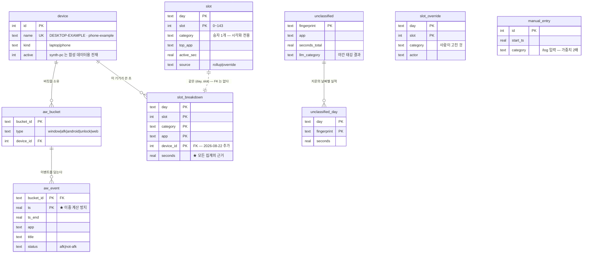
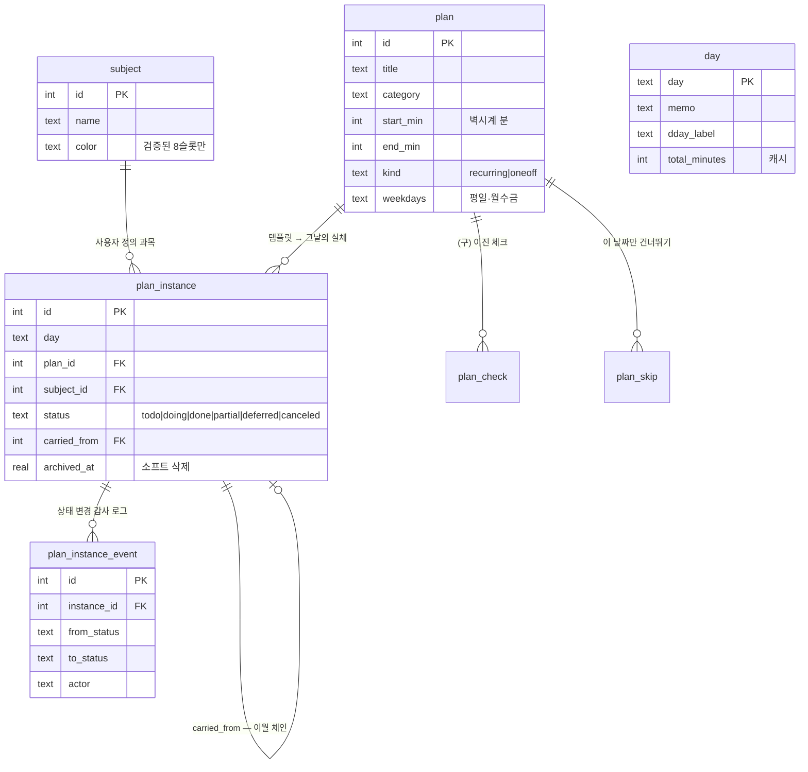
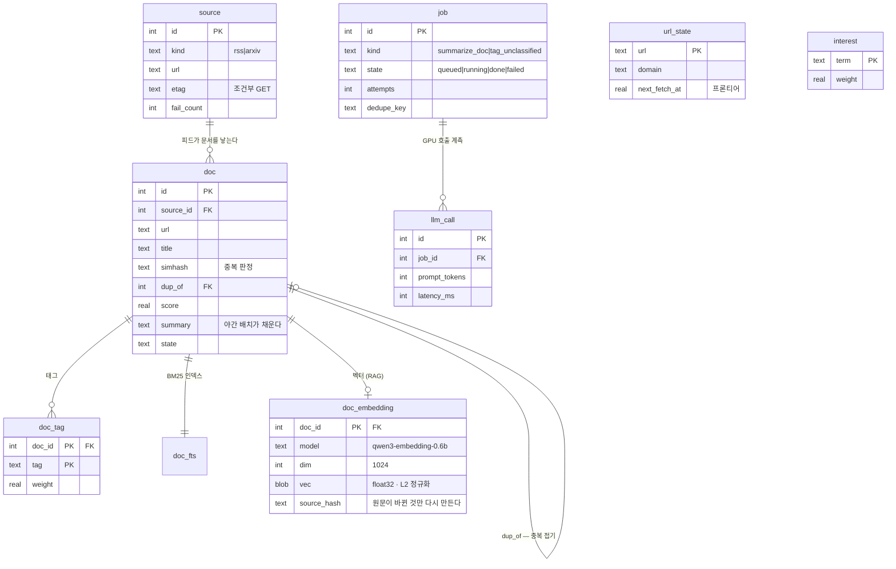
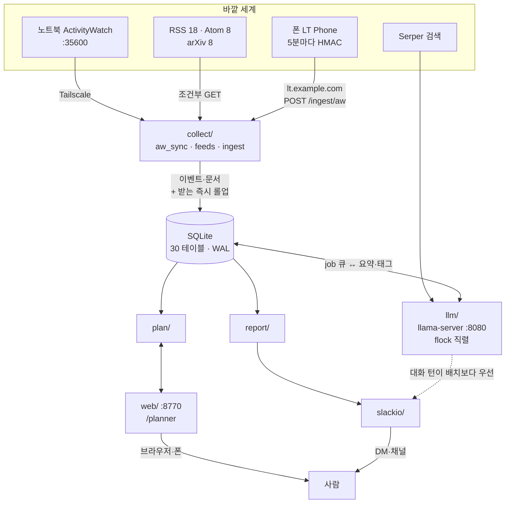
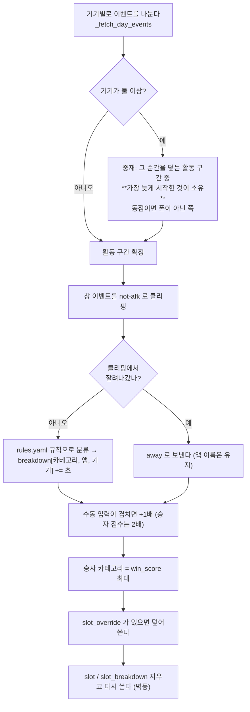
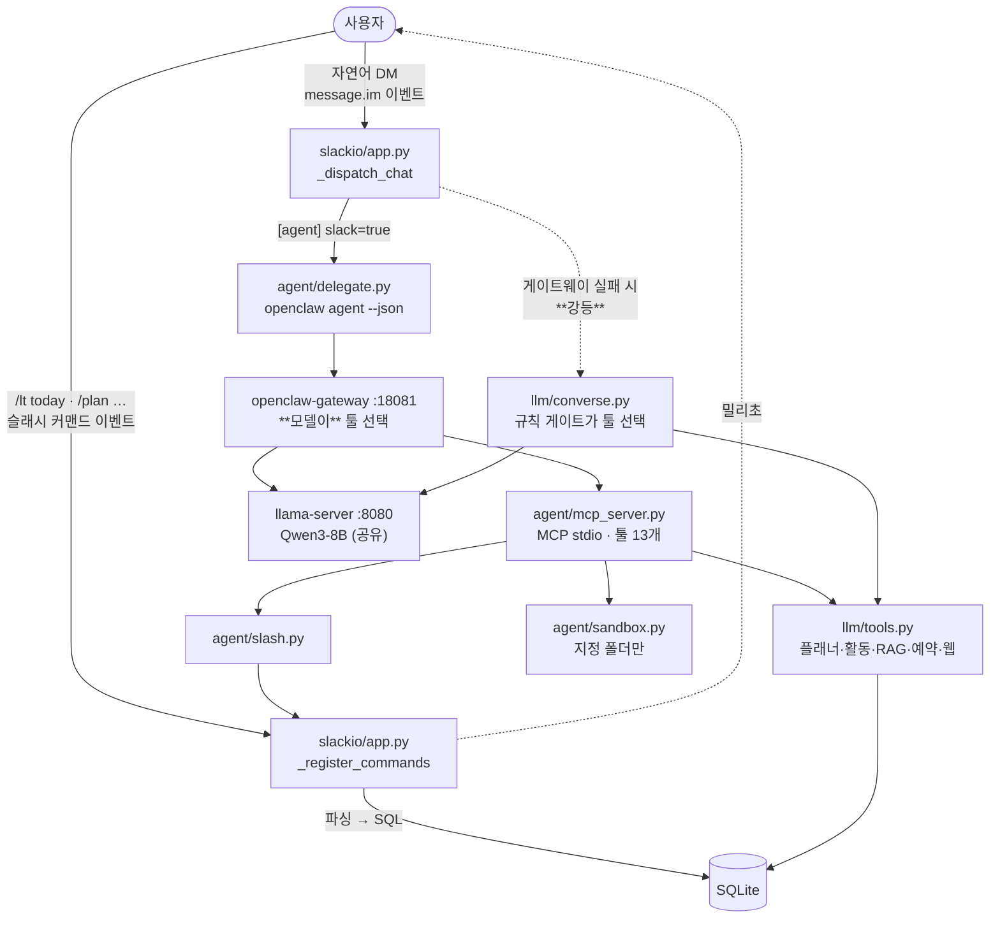

# 설계도 — ERD · 워크플로우 · 파일 구조 · 판정 근거

> **이 문서는 "왜 이 모양인가"를 그림과 근거로 답한다.**
> 무엇이 있고 어떻게 쓰는지는 [handbook.md](handbook.md) 가 서술로 답한다 — 둘을 겹쳐 쓰지 않는다.
> 시각화판: 같은 내용을 한 장으로 본 것이 [구조도 아티팩트](https://claude.ai/code/artifact/1762895b-896a-48b5-acf2-4935393062af).
>
> 현재 스키마는 v11, 테이블 32(일반 31 + FTS5 1) + 뷰 1. **모듈·줄·테스트 수는 여기 적지 않는다** —
> `make status` 와 `make test` 가 정본이다 ([HANDOFF §10](../HANDOFF.md#10-빠른-확인)).

---

## 1. ERD

일반 테이블 31개를 한 장에 그리면 못 읽는다. **계층 셋 + 부속**으로 나눈다.
계층 경계가 곧 설계 경계다 — 계층을 가로지르는 외래키는 `device` 하나뿐이다.

### 1-1. 활동 계층 — 기계가 계측한 것



> **`device` 예시 내역**: 노트북 `DESKTOP-EXAMPLE` · 폰 `phone-example` · `synth-pc`.
> 마지막 것은 초기 개발의 `lt synth` 용이라 **버킷과 실적이 없는 합성 기기**인데
> `kind='laptop'`·`active=1` 로 남아 있어 "노트북 2대"처럼 보인다. 쓸 일이 없으면
> `active=0` 으로 내려도 된다.

**읽는 법**: `slot` 과 `slot_breakdown` 은 외래키로 묶여 있지 않다. 같은 `(day, slot)`
좌표를 공유할 뿐이고, **둘 다 롤업이 지우고 다시 쓰는 파생 데이터**라 참조 무결성을
DB 에 맡길 이유가 없다. 반대로 `slot_override`·`manual_entry` 는 사람이 넣은 원본이라
롤업이 **절대 지우지 않는다** — 그래서 이 그림에서 화살표가 없다.

### 1-2. 계획 계층 — 사람이 선언한 것



### 1-3. 수집·처리 계층 — 바깥에서 온 것



### 1-4. 부속 (관계 없음)

`meta`(스키마 버전·마이그레이션 표식) · `sync_state`(동기화 커서·nonce) ·
`robots_cache`(도메인별 robots) · `report`(생성 리포트) · `alert_state`(알림 쿨다운).
전부 키-값에 가깝고 다른 테이블을 참조하지 않는다.

---

## 2. 워크플로우

### 2-1. 큰 흐름 — 합류점은 SQLite 하나



### 2-2. 롤업 한 칸(600초)이 정해지는 순서

이 순서가 **판정의 전부다.** 바꾸면 하루 집계가 통째로 달라진다.



**흡수는 중재보다 먼저다.** 5분 미만 공백은 `absorb_short_switches` 가 앞 활동으로
덮고 그 구간을 **잠근다**. 중재는 잠기지 않은 곳만 정한다 — 둘이 같은 구간을 각자
계산하면 어긋난다(반복 실패 2번).

### 2-3. 기기별 활동 판정 규칙

| | 컴퓨터 | 폰 |
|---|---|---|
| 정본 | `aw-watcher-afk` 의 `not-afk` 구간 | 같음 (포크가 화면·잠금해제로 합성) |
| **afk 가 아무 말도 안 한 구간** | 사실상 없음(워처가 상주) | **앱 세션을 활동으로 인정** ★ |
| 짧은 전환 흡수 | 5분 미만 공백을 앞 활동이 덮는다 | 적용 안 함 — **흡수당하는 쪽** |
| 겹칠 때 | 마지막 상호작용이 소유. 동점이면 컴퓨터 | 동점이면 진다 |

★ 폰의 afk 워처는 살아 있어야 보고하고 Doze 에 들어가면 멈춘다. 앱 세션(UsageStats)은
시스템이 **소급 기록**해서 Doze 구간도 나중에 올라온다. 그래서 **보고 공백은 부재의
증거가 아니다.** 이걸 자리비움으로 처리해 게임 세션이 통째로 날아간 적이 있다.

### 2-4. 하루 일정 (논리적 하루 06:00 → 다음날 06:00)

```
06:00 ─────────────────────────────────────────────── 다음날 06:00
 sync      10분마다   AW 동기화 + 오늘 롤업
 collect   매시       피드 수집 + 관심사 스코어링
 07:30     다이제스트 발송
 22:00(일) 주간 리포트
 23:30     일일 리포트
 02:00          8B 재기동 (operate/) — 무거운 배치를 가벼운 상태에서 시작한다
 02:10 ~ 05:50  야간 배치 — 문서 요약 · 미분류 태깅 (하루의 끝에 붙는다)
 06:10          8B 재기동 — 낮 시간을 가벼운 상태로
 상시      worker(GPU) · web(:8770) · slack(Socket Mode)
```

---

### 2-5. 질문 하나가 들어왔을 때 — 갈림길은 셋 (2026-08-24 구조 변경)

**Slack 에서 무엇을 쳤느냐로 갈린다. 같은 질문이 아니라 다른 이벤트다.**



**핵심은 "누가 툴을 고르는가" 다.**

| | 슬래시 | 에이전트 | 대화(강등) |
|---|---|---|---|
| 툴 선택 | 사람 | **모델** | 규칙(`llm/trigger.py`) |
| 지연 (실측) | 밀리초 | 21~82초 | 2~9초 |
| 쓰기 능력 | 전부 | 전부 (슬래시를 툴로 가짐) | **없음** — 조회 툴 10개뿐 |
| 실패 모드 | 없음 (코드가 실행) | 느림 | "했습니다" 하고 안 함 |

★ **대화 경로에 쓰기 툴이 없다는 것이 에이전트를 만든 이유다.** "1번 완료해줘" 를
물으면 8B 가 툴 없이 "완료했습니다" 라고 답하고 **에러도 안 난다.** 규칙을 더 짜서
막는 대신, 슬래시 10개를 **툴로 가진** 에이전트에게 자연어를 넘겼다.

★ **강등은 라우팅이 아니다.** 게이트웨이가 죽었을 때 사용자가 에러 대신 답을 받게
하는 것이다. 다만 **조용하면 안 된다** — 실제로 PATH 하나 때문에 몇 시간을 강등된 채
돌았는데 답이 빠르고 그럴듯해 아무도 몰랐다
([HISTORY](../HISTORY/2026-08-24-the-delegation-was-silently-falling-back.md)).
그래서 `lt doctor` 가 본다.

### 2-6. 에이전트는 어디까지 갈 수 있나

```
읽기   docs/  HISTORY/  config/  data/agent/     ← config/lifetrainer.toml 은 이름으로 거부
쓰기   data/agent/
```

`agent/sandbox.py` 가 `realpath` 로 접은 뒤 판정한다. **OpenClaw 의
`tools.fs.workspaceOnly` 를 안 쓰는 이유**: MCP 툴은 게이트웨이의 fs 정책을 거치지
않고 **우리 프로세스가 직접 파일을 연다.** 여기서 안 막으면 아무도 안 막는다.

소스 코드(`lifetrainer/`)는 어느 쪽에도 없다 — 의도한 것이다
(`operate/notes/agent-gateway.md §B`: 코딩은 이 모델에게 맡기지 않는다).

---

### 2-7. 누가 무엇을 정하나 — 층이 셋이다

**"이 프로젝트는 규칙 기반인가 에이전트인가" 는 잘못 물은 것이다.** 층마다 답이 다르고,
층을 섞으면 앱의 성격을 에이전트의 성과로 착각하게 된다.

```
① 에이전트 층    툴 선택 · 의도 파싱 · 질의 재작성 · 문장화
─────────────────────────────────────────────────────────
② 앱 층          분류 · 집계 · 중재 · 롤업
─────────────────────────────────────────────────────────
③ 경계           폴더 감옥 · 출구 게이트 · 산술 금지 · 툴 예산
```

#### ① 에이전트 층 — **평범한 function-calling 에이전트다**

모델이 툴을 고른다. 여기는 일반적인 에이전트와 **차이가 없다.**

#### ② 앱 층 — 에이전트는 **호출만 한다**

활동 분류(`config/rules.yaml`) · 슬롯 집계(고정 SQL) · 기기 중재(§2-3)는
**에이전트가 생기기 전부터 있던 것**이고, 툴은 그걸 부르는 창구일 뿐이다.

★ **여기를 "이 프로젝트는 규칙을 골랐다" 로 읽으면 안 된다.** 같은 앱 위에 다른
모델을 얹어도 똑같이 호출만 한다 — **에이전트가 고른 것이 아니라 애초에 에이전트
얘기가 아니다.** 슬래시 경로도 같은 함수를 부른다 (§2-5). 두 경로의 차이는
**툴을 고르는 주체 한 줄**이고, 툴 경계 아래는 완전히 같다.

#### ③ 경계 — **여기가 진짜 차이다**

모델이 오케스트레이션하게 되면서 **새로 필요해진 것들**이다. 슬래시만 있으면
하나도 필요 없다.

| 경계 | 왜 생겼나 | 어디에 |
|---|---|---|
| 폴더 감옥 | 모델이 파일 툴을 고를 수 있다 | §2-6 · `agent/sandbox.py` |
| **출구 게이트** | 이 경로엔 규칙 트리거가 없어 **입구에서 못 막는다** | §4-6 · `llm/websearch.py` |
| 산술 금지 (툴이 계산, 모델은 인용) | 8B 가 달성률을 지어냈다 | §4-3 |
| 툴 예산 3,000 토큰 | 매 턴 프롬프트에 실리므로 곧 지연 | `lt agent budget` |

> **모델에게 "무엇을 할지" 는 맡기고, "얼마인지" 와 "어디까지" 는 안 맡긴다.**
> 그 둘을 가르는 선이 ③이다.

구축 기록(어떻게 붙였나 · 함정)은 [`operate/notes/agent-gateway.md §7`](../../operate/notes/agent-gateway.md).

---

## 3. 폴더·파일 구조

### 3-1. 저장소 최상위 — 앱은 그중 하나다

```
project-jetson/
├── life-trainer/     411 파일 · 59M   이 앱
├── refs/models/           23G              GGUF 4개 (Qwen3 8B·4B·30B · EXAONE)
├── refs/reference/        7,529 파일       외부 저장소 참고본 (읽기 전용)
├── measure/findings/         6 문서           기기 실측치 — 대역폭 60GB/s, GPU 절반 게이팅
├── measure/results/          38 파일          벤치 원자료 (위 문서의 숫자 출처)
├── scripts/          20 파일          벤치·조사 (membw.cu · chat-bench)
├── docs/             9 문서           구축 기록·계획
└── openclaw-setup/   11 파일          Slack 에이전트 (별개로 돈다)
```

### 3-2. 앱 안 — 패키지 경계가 곧 워크플로우의 상자

```
life-trainer/
├── lifetrainer/                61 모듈 · 18,977줄
│   ├── collect/    11 · 2,598  AW 동기화 · RSS/arXiv · 폰 수신 · 크롤러 예의 계층
│   ├── rollup/      3 · 1,083  이벤트 → 슬롯 144칸 · 기기 중재 · 짧은 전환 흡수
│   ├── llm/        14 · 4,314  큐 · 워커 · 대화 · 툴 · 트리거 · 검색 · 읽기 · 임베딩
│   ├── agent/       8 · 1,957  **OpenClaw 결합** — 감옥 · 슬래시 · MCP · 프롬프트 · 위임
│   ├── plan/        5 · 1,192  템플릿 → 인스턴스 · 달성률 · 칸 보정
│   ├── report/      6 · 1,427  집계 · 플래너 PNG · 타임라인 PNG · 색 로딩
│   ├── slackio/     5 · 2,056  Socket Mode · 슬래시 명령 · Block Kit
│   ├── web/         3 · 1,425  플래너 서버 · HMAC 링크 · /planner 접두사
│   ├── cli.py           1,266  lt 명령 22개 — systemd 가 부르는 유일한 입구
│   ├── config.py          521  설정 로드 (TOML → 환경변수 덮어쓰기)
│   ├── db.py              319  스키마·마이그레이션
│   ├── timeutil.py        200  논리적 하루 계산 — 경계값은 여기서만
│   ├── schema.sql              테이블 정의 (새 DB)
│   └── migrations/             003 까지 (기존 DB)
├── tests/          단위·통합 (파일·개수는 `make status` · `make test`)
├── systemd/        유닛 목록은 `systemd/desired-state.txt` 가 정본 (`make status` 로 실제와 대조)
├── config/         palette.yaml(색 단일 원본) · rules.yaml(분류 규칙 — 수는 `make status`) · sources.yaml(피드 34)
├── docs/           handbook · issues/ · progress/ · 이 문서
├── HISTORY/        버그 1건 = 파일 1개 (색인은 그 폴더의 README)
├── android/        폰 수집 설계 (앱은 별 저장소 donghee-ai/LT-Phone)
└── data/           DB · PNG · 세션 비밀 (gitignore)
```

### 3-3. 문서를 어디에 쓰는가 — 폴더가 곧 규칙

표는 [`CLAUDE.md` §기록 규칙](../CLAUDE.md) 에 한 벌만 둔다. **여기 옮겨 적지 않는다** —
반복된 실패 2번("같은 값을 여러 곳에서 각자")이 문서에도 그대로 적용된다.

---

## 4. 설계 이유 및 판정

**이 프로젝트의 규칙은 대부분 사고에서 나왔다.** 아래 표의 "무엇이 그렇게 만들었나"는
전부 실제로 일어난 일이다 ([HISTORY/](../HISTORY/)).

### 4-1. 데이터 모델

| 판정 | 왜 | 무엇이 그렇게 만들었나 |
|---|---|---|
| **논리적 하루 = 06:00 → 06:00** | 새벽 2시 작업은 어제의 연장이다. 자정 경계는 사람의 하루와 안 맞는다 | 경계 변경 여파 3건 — "경계값은 한 곳에서만 쓴다"가 안 지켜져 있었다 |
| **`slot` 과 `slot_breakdown` 분리** | `slot` 은 칸당 승자 1개(시각화용), `breakdown` 은 칸×카테고리×앱×기기(집계용). 승자만 두면 "코딩 7분 + 웹 3분"이 "코딩 10분"이 된다 | 집계를 `slot` 으로 하다가 숫자가 부풀었다 |
| **`plan` 과 `plan_instance` 분리** | 템플릿에 하루 단위 상태(진행 중·연기)를 둘 자리가 없다 | 상태 6단계·이월 체인이 필요해졌을 때 |
| **`slot_override`·`manual_entry` 는 롤업이 안 지운다** | 파생은 지우고 다시 쓰지만 **사람이 넣은 것은 원본**이다 | 롤업 멱등성을 만들면서 |
| **`aw_event` PK = `(bucket_id, ts)`** | 같은 데이터를 다시 받아도 안 늘어난다 | 재전송·재동기화가 일상이다 |
| **`slot_breakdown` PK 에 `device_id`** | 폰과 노트북이 같은 슬롯에서 같은 앱 이름을 만들 수 있다 | [컬럼만 있고 100% NULL 이었다](../HISTORY/2026-08-22-breakdown-device-id-never-filled.md) — 채우는 순간 PK 충돌로 터지는 구조 |
| **파생 데이터는 지우고 다시 쓴다** | 누적하면 롤업을 다시 돌릴 때마다 부풀어 오른다 | `unclassified` 누적이 비멱등이었다 |

### 4-2. 판정 규칙

| 판정 | 왜 |
|---|---|
| **마지막 상호작용이 그 시간을 소유** | 진짜 기기 전환은 언제나 나중에 시작하는 구간을 만든다. 시작이 같으면 전환이 아니므로 폰이 아닌 쪽 |
| **5분 미만 전환은 앞 활동이 흡수** | "코딩 10분 / 폰 3분 / 코딩 10분"은 사람이 보기에 코딩 23분이다. 잠깐 딴짓까지 다 찍히면 플래너를 읽을 수 없다 |
| **흡수가 먼저, 중재는 나중** | 같은 구간을 둘이 각자 계산하면 어긋난다 (반복 실패 2번) |
| **afk 보고 공백 ≠ 부재** | 워처는 살아야 보고하고, 앱 세션은 소급 기록된다. 공백을 자리비움으로 처리해 게임 세션이 날아갔다 |
| **안드로이드는 `android` 타입으로 받는다** | `window` 로 받으면 변환이 여러 곳에 흩어진다. 어댑터 한 곳(`_android_to_window`)에서만 바꾼다 |

### 4-3. LLM

| 판정 | 왜 | 사고 |
|---|---|---|
| **프롬프트 3층 — 변하는 주기가 짧을수록 뒤로** | llama.cpp 가 공통 접두사를 재사용한다. 현재 시각을 시스템에 넣으면 하루 종일 캐시가 깨진다 | 12,541 토큰이 첫 턴 58초였다 |
| **바깥 정보는 툴이 아니라 선주입** | `tool_choice="required"` 는 툴 호출을 **본문 뒤로** 붙일 뿐이다. 모델이 틀린 답을 다 쓰고 나서 툴을 부른다 | [required 는 보장이 아니었다](../HISTORY/2026-08-19-required-tool-choice-is-not-a-guarantee.md) |
| **모델에게 산술을 시키지 않는다** | 주어진 숫자를 인용만 하게 한다 | 20:19 "20분" → 20:20 "40분" (정답은 줄어야 한다) |
| **의도와 측정을 함께 싣는다** | 한쪽만 주면 그걸로 나머지를 지어낸다 | [계획만 주입했더니 "다 했다"](../HISTORY/2026-08-17-plan-only-injection-hallucination.md) |
| **툴 결과는 "없는 것"도 말한다** | 빈손일 때 다른 걸로 대체하면 모델이 사실로 취급한다 | [폴백이 무관한 결과를 결과처럼](../HISTORY/2026-08-18-search-fallback-noise.md) |
| **닿을 방법 없으면 모델을 안 부른다** | 부르는 순간 빈자리를 기억으로 채운다 | 프롬프트로 막다 실패해서 **구조로** 막았다 |
| **JSON 스키마에 `pattern` 금지 · 배열에 `maxItems`** | GBNF 변환기가 400 을 낸다. 문법은 강제해도 길이는 모른다 | 태그 16개 뽑다 JSON 이 중간에서 잘렸다 |

### 4-4. 하드웨어가 강제한 것

| 판정 | 근거 (실측) |
|---|---|
| **GPU 잡 동시 실행 금지 (`flock`)** | llama-server 가 6.7GB(ctx 20480). 두 개 돌릴 메모리가 없다 |
| **대화 턴이 배치보다 우선 (`interactive_turn`)** | 배치가 GPU 를 잡고 있으면 2초짜리 질문이 20초가 된다 |
| **LLM 입력 3~5K 로 끊기** | 깊이 32K 에서 생성 속도 −70% |
| **파이썬 상주 300MB 이하** | 가용 4.5GB. 크로미움을 못 넣던 이유였으나 08-23 ctx 축소로 메모리는 더 이상 병목이 아니다 |
| **모델 id 까지 확인하는 헬스체크** | 포트만 보다 1시간 무중단 다운. **살아 있다 ≠ 서빙 가능하다** |

### 4-5. 색과 표현

| 판정 | 왜 |
|---|---|
| **`config/palette.yaml` 이 색 단일 원본** | 웹 CSS 와 PNG(matplotlib)가 각자 적으면 반드시 갈라진다 |
| **색은 검증기로 계산한다** | 눈대중 팔레트가 검증 3항목 FAIL — coding↔research 가 정상시야에서도 ΔE 12.0 이었다 |
| **2차 인코딩 필수** | all-pairs 검증이 실패하는 쌍이 남는다. 3칸 이상 블록에 이름을 적고 범례를 띄운다 |
| **폰 칸은 파스텔 + 점** | 비율 35% 는 OKLab ΔE 로 계산(자기 원색 18.0 · 남의 원색 12.2). **파스텔끼리는 6.9** 라 색에만 맡길 수 없어 점을 함께 찍는다 |
| **계획은 채우지 않고 테두리로** | 아직 일어나지 않은 것이라 실제보다 물러나 있어야 한다 |

### 4-6. 경계와 노출

| 판정 | 왜 |
|---|---|
| **검색은 질의어만 내보낸다** | 활동 원본은 로컬에 두지만 검색 질의는 외부 서비스로 전송된다. 120자에서 자른다. **질의어의 내용까지 보증하지는 않는다** — 게이트가 보는 것은 자기지칭 어형이라, 모델이 컨텍스트의 제목을 낱말로 뽑아 넣는 경로가 열려 있다 (`docs/issues/0031`) |
| **수신 경로는 하나** | 파일(`lt import`)과 네트워크(`POST /ingest/aw`)가 같은 `apply_payload` 를 쓴다. 갈라지면 "파일로는 되는데 네트워크로는 안 되는" 것을 디버깅하게 된다 |
| **인증은 요청 단위로 판정** | 같은 프로세스가 터널(HTTPS)과 tailnet(HTTP)을 동시에 서빙한다. 설정 하나로 정하면 한쪽이 깨진다 |
| **`/planner` 접두사 하나로 막는다** | 경로를 열거하면 나중에 추가한 라우트가 조용히 노출된다. 경계는 한 줄이어야 한다 |
| **`[ingest].secret` 과 `[web].session_secret` 분리** | 폰이 들고 있는 값이 새더라도 플래너 세션까지 열리면 안 된다 |
| **유출 게이트를 나가기 직전에 건다** | 아래 |

#### 왜 유출 게이트가 규칙이고, 왜 출구인가 (2026-08-27)

개인 발화가 검색 API 로 나갔다
([HISTORY](../HISTORY/2026-08-27-the-gate-judged-one-string-and-sent-another.md)).
**게이트는 정확했다** — 그 문장을 지금도 막는다. 틀린 것은 **게이트를 어디에 걸었는가**였다.

```
입구에서 판정  →  [코드가 문자열을 다시 조립]  →  발송
                   ↑ 여기서 게이트가 무효가 된다
```

→ **검사와 발송 사이에 코드가 있으면 그 코드가 검사를 무효로 만든다.**
   가공된 뒤에 다시 검사한다. `websearch.search()` 가 그 자리다 —
   선주입 · 모델의 툴 호출 · MCP 가 전부 이 함수로 합류하므로
   **새 호출자가 생겨도 못 빠져나간다** (§2-7 ③).

**LLM 가드레일을 안 쓰는 이유 넷:**

| | |
|---|---|
| 테스트 가능해야 한다 | 정규식은 `must-pass`/`must-fail` 로 고정된다. 회귀 5건이 유출 재현과 **정상 검색 보존**을 같이 본다 — 막느라 기능을 죽이는 것이 이 부류의 2차 사고다 |
| 설득당하면 안 된다 | 모델 가드레일은 프롬프트로 넘어간다 |
| 체급 | 8B 에게 "이거 개인정보야?" 를 물으면 판정도 못 미덥고 GPU 한 턴을 더 쓴다 |
| 위치가 먼저다 | 규칙이든 LLM 이든 **재조립 뒤**에 걸지 않으면 같은 사고가 난다 |

★ 트리거는 **조이지 않았다.** 조이면 `게임 tft는?` 같은 정상 되묻기가 같이 죽는다.
**"실을지"(관대해도 된다)와 "내보낼지"(아니다)는 다른 판단**이다.

### 4-7. 이 프로젝트에서 반복된 실패 (같은 부류를 의심할 것)

목록은 [`CLAUDE.md`](../CLAUDE.md) 에 한 벌만 둔다.

★ **여기 옮겨 적은 판은 네 항목에서 멈춰 있었다.** 다섯 번째("감시를 붙일 때
'언제 안 울리나'를 안 정했다", 2026-08-28)가 원본에만 추가됐다 —
목록을 두 곳에 두면 이렇게 된다는 실례라 지우면서 이 줄을 남긴다.
