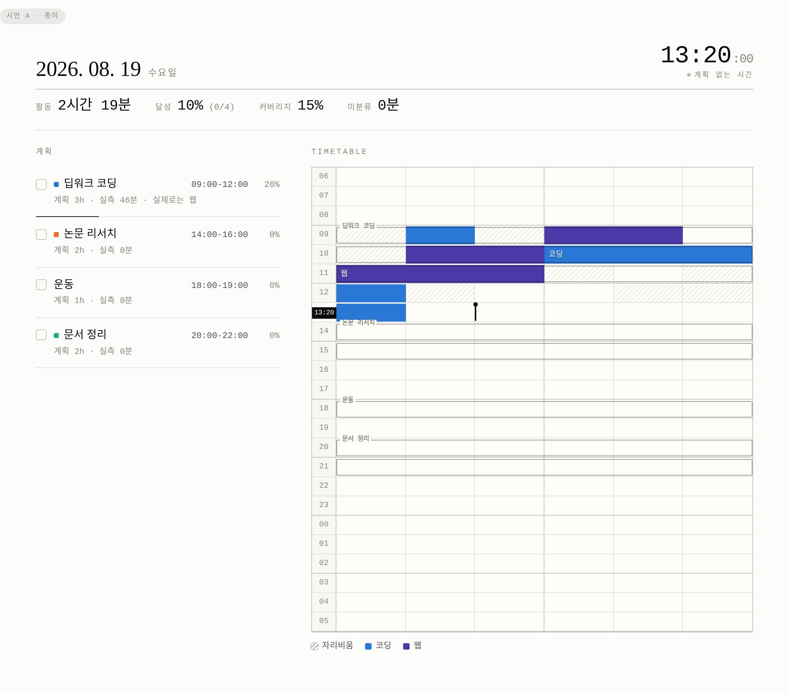
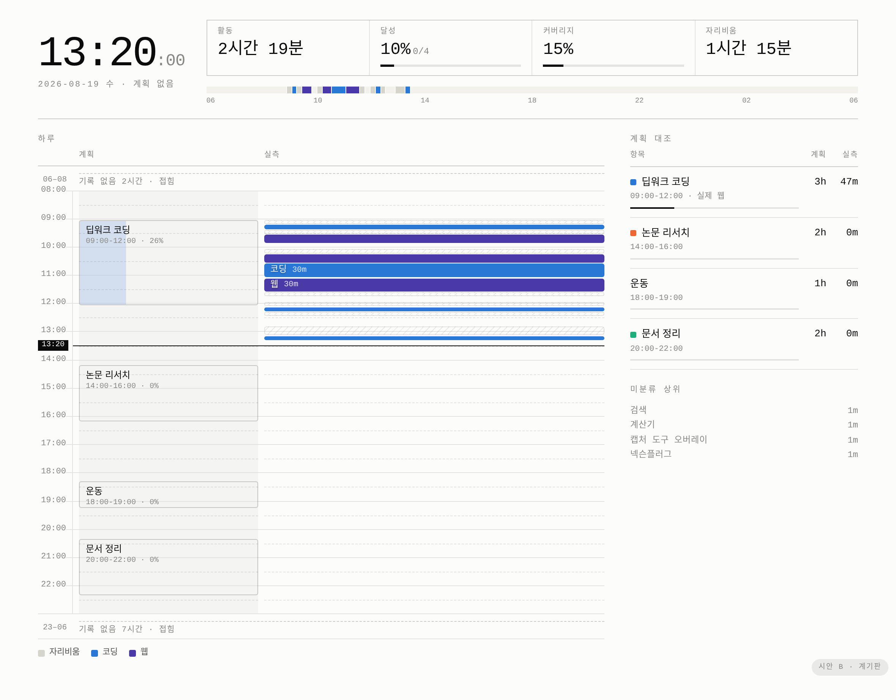
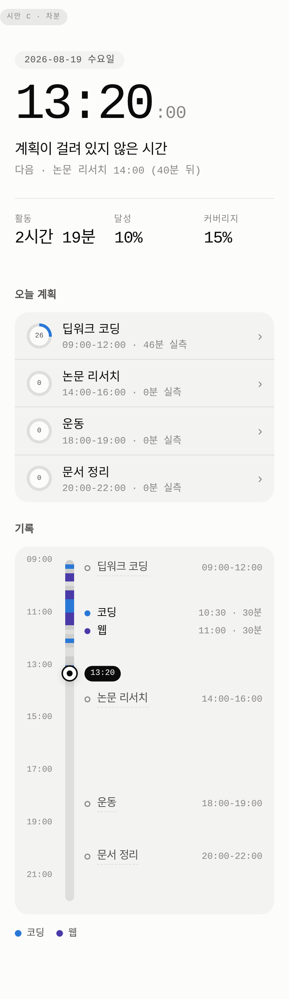

# 플래너 UI 개편 — 시안 3종 + HTML→PNG 검토

> 2026-08-19. 1차 A+C 구현이 사용자 피드백에서 기각되어 **10mPlanerwElec + Dayflow
> 중심으로 2차 재설계했다.**
> 구현 결과: [데스크톱](shots/redesign-v2-desktop.png) · [모바일](shots/redesign-v2-mobile.png) ·
> [다크](shots/redesign-v2-dark.png)
>
> ★ **데스크톱·다크 두 장은 2026-09-08 에 다시 찍었다.** 원본은 실 DB 로 렌더한 것이라
> "오늘의 기록" 패널에 **실제 창 제목**(학교·비공개 프로젝트명·SSH 호스트)이 그대로
> 들어 있었다. 지금 것은 `lt synth` 합성 데이터로 찍은 것이라 그 자리가 전부 가명이다.
> 그래서 화면도 **2026-08-31 의 2차 시안이 아니라 지금 구현**이다 — 그 사이에
> 프라이빗 · 오늘의 수면 · 격자/차트/원그래프 전환이 들어왔다.
> (모바일은 원본이 그 패널 앞에서 잘려 있어 그대로 둔다.)
> 보기 이름을 `차트`·`원그래프`로 다듬은 뒤 데스크톱·다크 화면도 합성 데이터로 다시 찍었다.
> 비교 화면: [mockups/index.html](mockups/index.html) (브라우저로 직접 열면 된다)
> 외부 레퍼런스(원조 종이 플래너·TENS 앱·오픈소스 구현, 라이선스 표기 포함):
> **[refs/10min_design/](refs/10min_design/README.md)**

---

## 0. 지금 화면의 문제 (스크린샷: [shots/00-current-web.png](shots/00-current-web.png))

눈대중이 아니라 항목으로 적는다. 고쳐야 할 것이 무엇인지 합의가 되어야 시안을 고를 수 있다.

| # | 무엇 | 왜 문제인가 |
|---|---|---|
| 1 | **날짜가 두 번 찍힌다** | 상단 내비에 `2026-08-19`, 바로 아래 eyebrow 에 `수요일 · 2026-08-19` |
| 2 | **현재 시각이 아예 없다** | 있는 건 격자 위에 뜬 검은 `NOW` 알약 하나. 몇 시인지는 안 적혀 있다 |
| 3 | **NOW 알약이 데이터를 가린다** | 격자 위에 겹쳐 뜨는데 그 아래 칸이 안 보인다 |
| 4 | **10분 칸 144개가 전부 따로 논다** | `gap: 2px` + 둥근 모서리 → 알약 144개가 흩어진 그림. 덩어리(연속 활동)가 안 보인다 |
| 5 | **자리비움이 활동처럼 보인다** | 회색 채움이라 카테고리 색과 같은 층으로 읽힌다. 구조 상태는 활동이 아니다 |
| 6 | **범례가 항상 9개 전부** | 그날 안 나온 카테고리까지 띄운다 |
| 7 | **데스크톱에서 폭을 안 쓴다** | 모바일 우선 레이아웃 그대로라 1280px 에서 오른쪽 절반이 빈다 |
| 8 | **계획 카드에 버튼이 상주** | `건너뜀`·`삭제` 가 항상 보여 카드 폭의 1/3 을 먹는다 |
| 9 | **달성률이 막대뿐** | 숫자가 없다. PNG 에는 `24%` 가 있는데 웹에는 없다 |

---

## 1. 시안 3종

셋 다 **같은 날(2026-08-19) 같은 데이터**로 그렸고, 색은 `config/palette.yaml` 에서
뽑아 쓴다 — 시안 HTML 안에 hex 는 한 글자도 없다. 시각은 `?now=13:20` 으로 고정했다.

### A · 종이 (Paper Refined) — [a-paper.html](mockups/a-paper.html)



**전제: 지금 구조가 틀린 게 아니라 덜 다듬어졌다.** 24행 × 6칸 격자를 유지한다.

- 격자 간격을 **0** 으로. 헤어라인 1px, 30분마다 진한 선, 3시간마다 굵은 괘선 — 종이 그대로
- 연속된 같은 카테고리는 **한 덩어리**로 병합(시간 행 경계에서만 줄바꿈)
- **자리비움은 채우지 않고 사선(hatch)** — 활동 색과 층이 갈린다
- 현재 시각: 머리글 우측에 큰 tabular 시계 + 격자에는 **그 줄의 재생헤드**(세로 막대)와
  시각 라벨 자리의 `13:20` 칩. 데이터를 하나도 안 가린다
- 계획 목록은 카드가 아니라 괘선 행. 달성률은 별도 막대가 아니라 **항목 밑줄이 채워진다**
- 범례는 그날 나온 것만

| | |
|---|---|
| **장점** | 바꿀 파일이 가장 적다(`planner.css` 중심). 기존 계약서 §5(계획은 테두리로만)와 그대로 맞는다. 종이 플래너 계보를 유지 |
| **단점** | 여전히 24행 격자라 데스크톱 폭이 남는다. 10분 칸의 물리적 크기 문제는 그대로 |

### B · 계기판 (Console) — [b-console.html](mockups/b-console.html)



**전제: 6칸 줄바꿈은 종이의 제약이지 화면의 제약이 아니다.**

- **계획 레인 | 실측 레인을 나란히** 둔다. 의도와 실제를 겹치지 않고 대조한다
- 블록은 **시간 길이에 비례**한다. 09:00-12:00 계획은 3시간짜리 한 덩어리
- **빈 구간은 접는다** — 오늘은 `06–08 접힘`, `23–06 접힘` 으로 7시간이 한 줄이 됐다
- 머리글에 24시간 요약 띠. 접힌 구간까지 포함해 "하루의 모양"은 남는다
- 현재 시각이 화면에서 가장 큰 숫자. 눈금자의 NOW 선과 **같은 값**을 쓴다
- 우측에 계획/실측 대조표(`3h` vs `47m`)

| | |
|---|---|
| **장점** | "계획 대비 실제"를 가장 정직하게 보여준다. 빈 시간이 화면을 안 먹는다 |
| **단점** | 폰에서 밀도가 부담(2×2 KPI 로 접어도 빡빡). 종이 플래너 계보에서 가장 멀다. 구현량 최대 |

### C · 차분 (Calm) — [c-calm.html](mockups/c-calm.html)



**전제: 이 화면은 폰에서 하루에 열 번 여는 화면이다.** 밀도를 포기한다.

- 현재 시각과 **지금 걸린 계획**이 주인공. 계획이 없으면 지어내지 않고 "다음 · 논문 리서치 14:00 (40분 뒤)"
- 타임테이블은 격자가 아니라 **레일 + 피드**. 30분 이상 블록만 이름이 붙는다
- 계획 행마다 달성률 링. 터치 타깃 62px
- 기록이 있는 구간만 레일에 담는다(잠든 7시간을 스크롤할 이유가 없다)

| | |
|---|---|
| **장점** | 폰에서 압도적으로 읽기 쉽다. "지금 뭐 하지"에 바로 답한다 |
| **단점** | **하루 전체를 뜯어보는 용도를 포기**한다(주간 뷰·PNG 로 넘긴다). 10분 해상도가 안 보인다 |

### 현재 시각 표시만 따로 비교

| | A | B | C |
|---|---|---|---|
| 시계 | 머리글 우측 `13:20:00` | 화면 최대 크기 `13:20:00` | 히어로 `13:20:00` |
| 격자 위 | 그 줄의 재생헤드 + 좌측 `13:20` 칩 | 가로 실선 + 좌측 `13:20` 칩 | 레일 위 점 + `13:20` 알약 |
| 가림 | 없음 (시각 라벨 자리를 쓴다) | 없음 (눈금자 여백) | 없음 |

셋 다 지금의 "검은 NOW 알약이 데이터 위를 덮는" 문제는 해소한다.

---

## 2. HTML → PNG 는 되는가 (실측)

Slack 으로 보내는 플래너 PNG 는 지금 `report/planner.py` 570줄이 matplotlib 로
**좌표를 직접 계산**해 그린다. 같은 레이아웃이 `web/templates/planner.html` +
`planner.css` 에 **한 번 더** 구현돼 있다. 이 이중 구현은 이미 사고를 냈다 —
[플래너 PNG 가 밤 활동을 낮 칸에 그렸다](../../HISTORY/2026-08-18-planner-row-offset.md)
(웹·timeline 은 고쳤는데 planner.py 만 빠져 6시간 밀림).

헤드리스 크로미움으로 HTML 을 찍으면 그 이중 구현이 사라진다. **젯슨에서 직접 쟀다:**

```
HTML → PNG   (chromium headless, 콜드 기동, 1020px×1.5배)   1.71s   PSS 최대 197 MB
matplotlib   (lt planner --day)                             1.47s   peak RSS  76 MB
                                                            ------   ------------
                                                            +0.24s   +121 MB (일시)
```

- 3회 반복 편차 ±0.03s / ±10MB. `chromium-headless-shell` 도 같은 수준(1.1s)
- 크로미움은 **이미 깔려 있다** (`~/.cache/ms-playwright/chromium-1237`, arm64, node v22)
- 메모리 197MB 는 **상주가 아니라 2초짜리 스파이크**다. CLAUDE.md 의 "파이썬 상주
  300MB 이하" 는 상주 프로세스 규칙이라 여기 걸리지 않는다. 다만 llama-server 가
  6.7GB 를 쥔 상태에서 가용이 ~4.5GB 이므로 **GPU 잡과 동시에 띄우지 않는 것이 안전**하다
  (`fcntl.flock` 과 같은 방식으로 직렬화하면 된다)

| | 지금 (matplotlib) | HTML → PNG |
|---|---|---|
| 레이아웃 정의 | 파이썬 좌표 계산 (570줄) | 웹과 **같은** CSS |
| 웹/PNG 불일치 | 구조적으로 발생 (실제 사고 1건) | 원천 제거 |
| 한글 폰트 | `font_manager` 폴백, 두부(□) 위험 | 시스템 폰트 스택 그대로 |
| 다크 테마 | `--theme dark` 별도 경로 | `colorScheme` 인자 하나 |
| 의존성 | matplotlib (이미 있음) | node + chromium (이미 있음) |
| 렌더 시간/메모리 | 1.47s / 76MB | 1.71s / 197MB(일시) |

**권장: 간다.** 비용은 +0.24초 / 일시적 120MB 이고, 얻는 것은 "같은 것을 두 번
구현하지 않는다"는 이 프로젝트가 이미 값을 치른 교훈이다(CLAUDE.md 반복 실패 #2).

구현 시 정할 것 (아직 안 정했다):

- **찍는 대상**: 라이브 웹 서버(`/d/<day>?export=1`)를 찍을지, 템플릿을 임시 HTML 로
  렌더해 `file://` 로 찍을지. `file://` 이 인증·네트워크를 안 타서 단순하다
- **`?export=1` 모드가 필요하다** — 내비/버튼/폼을 숨기고 본문 높이에 맞춰 자른다
  (지금 `fullPage` 로 찍으면 아래쪽 빈 공간이 딸려 온다)
- **폴백**: 크로미움 기동 실패 시 matplotlib 경로를 남길지, 아니면 Slack 에 텍스트만
  보낼지. `lt doctor` 에 항목을 하나 늘리는 편이 낫다
- 노드 스크립트는 `scripts/render-png.js` 한 파일 (`playwright` 는 `@playwright/mcp`
  안에 이미 있지만, 정식으로 쓰려면 `npm i -D playwright` 로 명시적 의존을 잡는 게 맞다)

---

## 3. 최종 구현 결정 (2026-08-19, 2차)

1차 A+C 혼합형은 종이 질감과 작은 정보 밀도가 중심이어서 사용자 피드백에서
기각했다. 2차는 요청한 다섯 계보의 역할을 명확히 나눴다.

| 계보 | 가져온 역할 |
|---|---|
| **10mPlanerwElec (핵심)** | 화면 2/3 타임테이블 + 1/3 작업 사이드바, `10 20 30 40 50 60`, 넓은 데스크톱 활용 |
| **Dayflow (핵심)** | 자동 수집 슬롯을 연속 활동으로 합쳐 `시각 + 카테고리 + 실제 창 제목`의 읽는 타임라인 생성 |
| 모트모트 | 24×6 연속 격자, 계획=선/실측=채움, 자리비움은 활동색에서 제외 |
| Apple | 컨트롤/콘텐츠 층 분리, 큰 여백과 명확한 제목, 화면 폭에 맞는 split→single column 적응 |
| Toss | 핵심 수치 우선, 파란 단일 CTA, 한 카드 안에서 상태가 일관된 행 컴포넌트 |

Apple HIG의 [계층·적응형 레이아웃](https://developer.apple.com/design/human-interface-guidelines/layout),
Toss의 [One thing for One Page](https://toss.tech/article/engineering-note-1),
Dayflow의 [자동 타임라인](https://www.dayflow.so/)을 구현 원칙 확인에 사용했다.
Dayflow와 10mPlanerwElec는 MIT지만 코드를 복사하지 않고 구조만 바닐라 HTML/CSS/JS로
다시 구현했다.

색은 계속 `config/palette.yaml` 한 곳에서 주입하며, 외부 폰트·CDN·GPL/AGPL 코드는
추가하지 않았다. 화면 구현은 저장소의 바닐라 HTML/CSS/JS와 기존 Flask API만 쓴다.

## 4. 후속 후보

1. `?export=1` 추가 → `scripts/render-png.js` → `lt planner` 를 HTML 경로로 교체
2. `report/planner.py` 는 HTML 캡처 경로가 검증될 때까지 폴백으로 유지
3. 계획 드래그 재배치/리사이즈는 사용 빈도를 먼저 본 뒤 추가 — 터치 충돌 비용이 큼

---

## 파일

```
mockups/index.html     3종 나란히 비교 (여기부터 열면 된다)
mockups/a-paper.html   시안 A
mockups/b-console.html 시안 B
mockups/c-calm.html    시안 C
mockups/data.js        2026-08-19 합성 데이터 + 팔레트 CSS 변수
mockups/common.js      셋이 공유하는 계산(런 병합·시각 포맷) — 디자인은 안 들어 있다
shots/                 위 시안들을 헤드리스 크로미움으로 찍은 PNG (라이트/다크/모바일)
refs/10min_design/     외부 레퍼런스 조사 — 캡처 22장 + 출처 링크 + 오픈소스 여부
```
