# 10분 플래너 레퍼런스 — 실물 수집

> 2026-08-19. 온라인에서 직접 캡처했다(Playwright + 번들 Chromium, headless).
> 각 항목에 **출처 링크**와 **오픈소스 여부·라이선스**를 붙였다. 확인 못 한 건
> "확인 불가"로 적었지 추측으로 채우지 않았다.
>
> 이건 조사 기록이지 결정이 아니다. 시안 선택은 [../../README.md](../../README.md) 에서 한다.

---

## 0. 먼저 — "텐미닛 플래너" 라는 이름은 쓰면 안 된다

모트모트 상품 페이지가 자사 문구로 직접 밝힌다:

> **10MINUTES PLANNER®** / Manufactured by motemote in South Korea / ©motemote. All rights reserved.
> **\*텐미닛 플래너/10분 플래너는 모트모트의 고유 상표 자산입니다.**

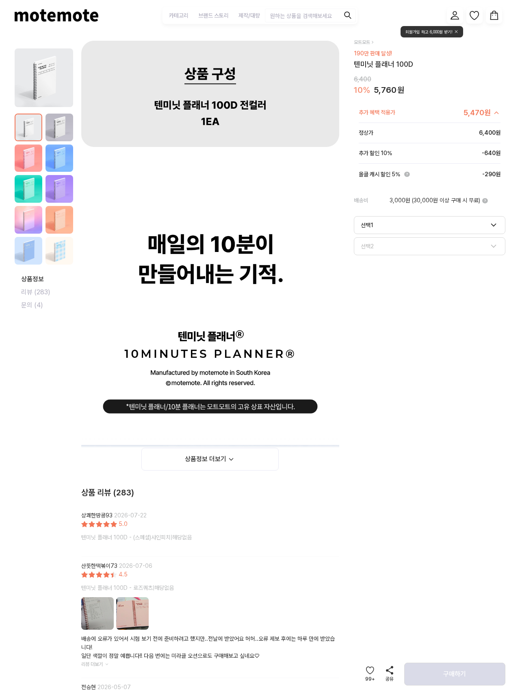

출처: <https://motemote.kr/product/116299997>

- **"텐미닛 플래너", "10분 플래너", "10MINUTES PLANNER" 는 판매자가 자기 상표라고 주장하는 문자열이다.**
  ® 표기까지 붙여 놨다. 우리 기능·화면·문서에서 제품명으로 쓰지 않는다
- 반대로 **"하루를 10분 칸으로 쪼갠 시간표"라는 형식 자체**는 학교 시간표만큼 오래된
  것이고 아래 D절의 종이 플래너들이 독립적으로 같은 걸 하고 있다. 형식을 따라하는 건
  문제가 아니고 **이름과 지면 디자인을 그대로 베끼는 것**이 문제다
- 우리 코드가 이미 쓰는 중립적 표현(`slot`, `10분 슬롯`, `타임테이블`)을 유지하면 된다

> 나는 변리사가 아니다. 위는 **판매자가 자기 페이지에 써 둔 주장**을 옮긴 것이고
> 등록 여부·권리 범위를 내가 확인한 게 아니다. 제품명으로 쓸 일이 생기면 그때 확인해야 한다.

---

## 1. 한눈에 — 오픈소스 여부

| # | 레퍼런스 | 형태 | 오픈소스 | 라이선스 | 출처 |
|---|---|---|---|---|---|
| A1 | 모트모트 텐미닛 플래너 | 종이 | ❌ **아니오** | 상용 제품 · 상표 주장 | [motemote.kr](https://motemote.kr/product/116299997) |
| A2 | 플래너 TENS | 안드로이드 앱 | ❌ **아니오** | 비공개 상용 | [Google Play](https://play.google.com/store/apps/details?id=com.bigroad.tens&hl=ko) |
| A3 | 10 MINS PLANNER (웹) | 웹앱 | ❓ **확인 불가** | 표기 없음 · 저장소 못 찾음 | [planner-swart-zeta.vercel.app](https://planner-swart-zeta.vercel.app/) |
| B1 | 10mPlanerwElec | 웹(HTML) | ✅ **예** | **MIT** | [GitHub](https://github.com/morogohi/10mPlanerwElec) |
| C1 | ActivityWatch | 데스크톱+웹UI | ✅ **예** | **MPL-2.0** | [GitHub](https://github.com/ActivityWatch/activitywatch) |
| C2 | Dayflow | macOS 앱 | ✅ **예** | **MIT** | [GitHub](https://github.com/JerryZLiu/Dayflow) |
| C3 | TimeTagger | 웹 (셀프호스팅) | ✅ **예** | **GPL-3.0** | [GitHub](https://github.com/almarklein/timetagger) |
| C4 | solidtime | 웹 (셀프호스팅) | ✅ **예** | **AGPL-3.0** | [GitHub](https://github.com/solidtime-io/solidtime) |
| C5 | Kimai | 웹 (셀프호스팅) | ✅ **예** | **AGPL-3.0** | [GitHub](https://github.com/kimai/kimai) |
| C6 | Super Productivity | 데스크톱+웹 | ✅ **예** | **MIT** | [GitHub](https://github.com/super-productivity/super-productivity) |
| D1 | Emergent Task Planner | 종이(PDF) | ❌ **아니오** | 개인 사용 무료 · 상업용 별도 문의 · ™ | [davidseah.com](https://davidseah.com/node/the-emergent-task-planner/) |
| D2 | reMarkable Daily Planner Generator | PDF 생성기 | ✅ **예** | **MIT** | [GitHub](https://github.com/alexgorbatchev/remarkable-daily-planner-generator) |
| D3 | digital-planner-generator | PDF 생성기 | ✅ **예** | **MIT** (저장소에 LICENSE 있음, GitHub 자동인식 실패) | [GitHub](https://github.com/mohanrex/digital-planner-generator) |
| D4 | remarkable-daily-planner | PDF 생성기 | ⚠️ **소스는 공개, 라이선스 없음** | **LICENSE 파일 없음 = 기본 저작권** | [GitHub](https://github.com/vikboyechko/remarkable-daily-planner) |

**라이선스 읽는 법 (우리 프로젝트 기준):**

- **MIT** — 코드를 가져다 써도 된다. 저작권 고지만 남기면 된다
- **MPL-2.0** — 파일 단위 카피레프트. 가져온 *그 파일*만 공개 의무. 우리처럼 붙여 쓰는 건 안전
- **GPL-3.0 / AGPL-3.0** — 강한 카피레프트. **코드를 가져오면 안 된다.**
  특히 AGPL 은 네트워크로 제공만 해도 소스 공개 의무가 붙는다. **보고 배우는 것만 한다**
- **LICENSE 없음(D4·A3)** — "공개 = 사용 허가"가 아니다. 기본 저작권이라 복제·수정 권리가 없다.
  **화면을 참고하는 건 되고 코드를 가져오는 건 안 된다**

---

## A. 원조 계보 — 10분 격자가 실제로 어떻게 생겼나 (전부 비오픈소스)

### A1 · 모트모트 텐미닛 플래너 (종이) — ❌ 비오픈소스

누적 190만 부 판매, 리뷰 283건. 5,760원. 이게 한국에서 "10분 플래너" 의 기준점이다.

**내지 구성** — 하루 지면은 `TASKS` + `TIMETABLE` 두 칼럼이다:

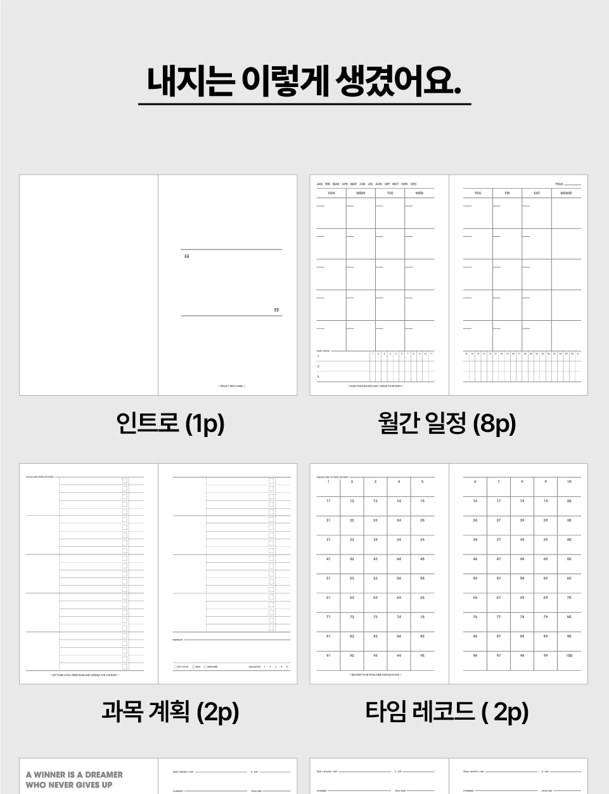

**데일리 스프레드 (좌: 빈 양식 / 우: 실제 사용 예)**

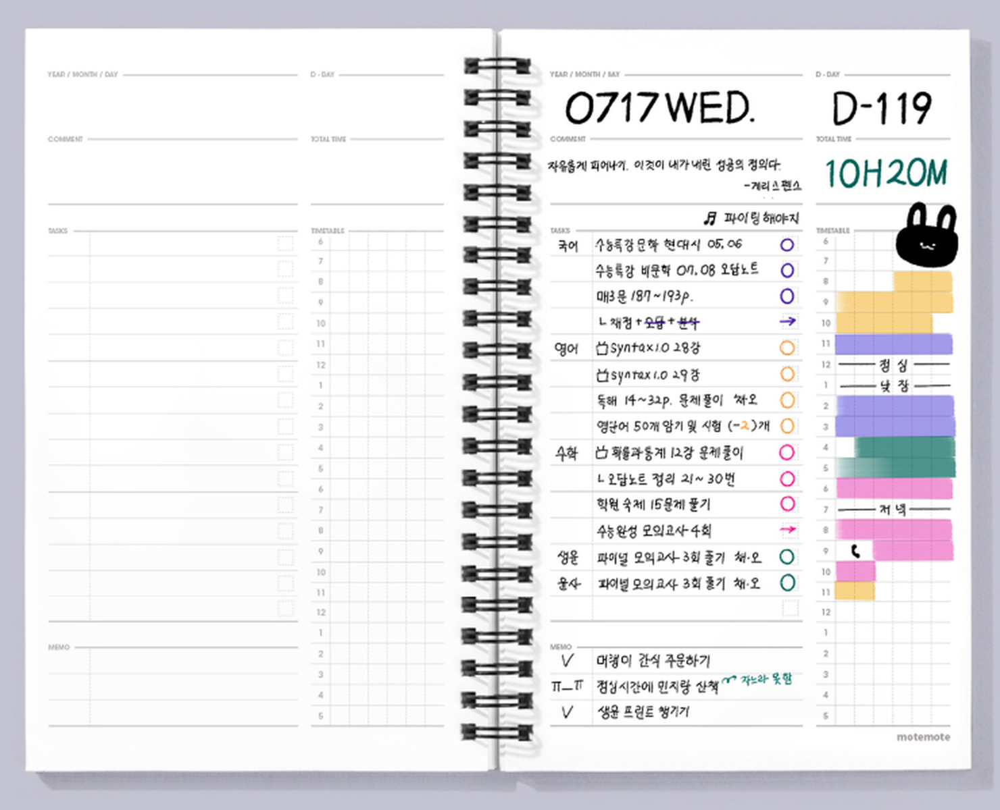

**타임테이블 칼럼 확대 — 여기가 핵심이다**

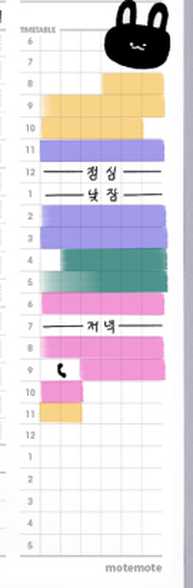

읽어낸 구조:

| 무엇 | 어떻게 |
|---|---|
| 격자 | **세로 24개 시간 행 × 가로 6칸(10분)** — 우리 `planner.py` 의 24×6 과 **정확히 같다** |
| 시작 시각 | **6시부터** 시작해 다음날 5시로 끝난다 (우리 논리적 하루 06:00 시작과 같은 계보) |
| 칸 경계 | 10분 칸은 **아주 옅은 점선**, 시간 행 경계만 실선. 칸이 따로 놀지 않는다 |
| 활동 표시 | 형광펜으로 **연속 칠하기**. 칸 단위가 아니라 **덩어리**로 읽힌다 |
| 색 수 | 실사용 예에서 **4색**(노랑·보라·초록·분홍)만 썼다. 9색이 아니다 |
| 구조 상태 | `점심`, `낮잠`, `저녁` 은 **색이 아니라 가로 실선 + 글자**로 적는다 |
| 합계 | 우상단 `10H 20M` 손글씨 — 하루 총량이 가장 큰 숫자 |
| 빈 시간 | 자정 이후는 **그냥 빈칸**. 접거나 숨기지 않는다 |

> **우리 시안 A(종이) 가 하려던 것이 바로 이거다.** "gap 0 + 헤어라인 + 덩어리 병합 +
> 자리비움은 활동색과 층 분리" 는 원본이 이미 하고 있던 규칙이다. 시안 A 는 창작이 아니라
> **복원**에 가깝다. 다만 원본은 **구조 상태(점심·낮잠)를 색으로 칠하지 않는다** —
> 시안 A 의 사선(hatch) 보다 원본의 "선+글자" 가 더 강하게 층을 가른다.

- 출처: <https://motemote.kr/product/116299997>
- 상세 이미지 원본: 위 상품 페이지의 상품정보 영역 (스크린샷은 해당 페이지에서 잘라냄)
- 상용 유통 확인: <https://www.yes24.com/product/goods/76162429> — 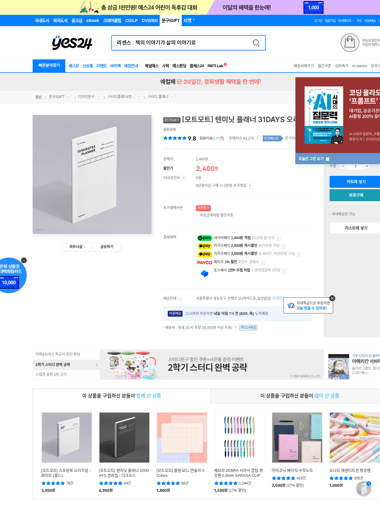

### A2 · 플래너 TENS (안드로이드) — ❌ 비오픈소스

모트모트 종이 플래너를 그대로 앱으로 옮긴 것. 앱 소개문이 대놓고
"**'모트모트 텐미닛 플래너'의 감성을 이제 스마트폰에서 경험하세요**" 라고 쓴다.
(개발사 BIGROAD, 다운로드 50+, 최종 업데이트 2026-03-12)

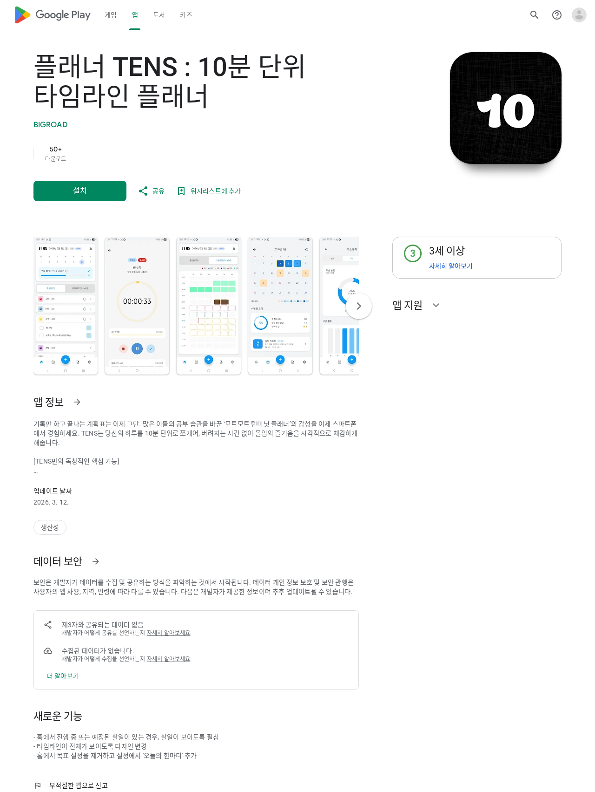

**타임라인 화면 — 우리가 만들려는 것과 가장 가까운 화면이다**

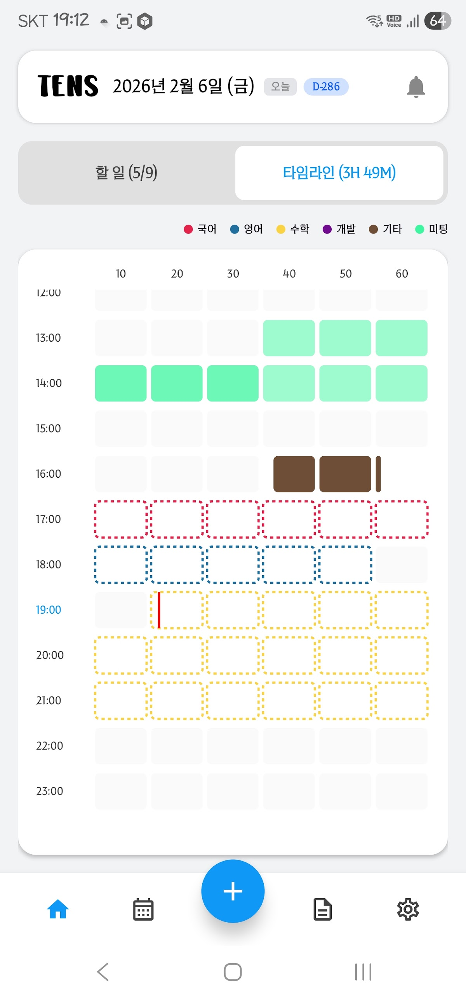

여기서 배울 것:

| 무엇 | TENS 가 한 방식 | 우리 상황 |
|---|---|---|
| **계획 vs 실측** | **계획 = 점선 테두리 빈 칸 / 실측 = 채운 칸.** 같은 격자 위에 겹쳐 얹는다 | 계약서 §5 "계획은 테두리로만" 과 **동일한 규칙**. 남이 독립적으로 같은 답에 도달했다 |
| **현재 시각** | 19:00 행 안쪽에 **가는 빨간 세로선**. 칸을 하나도 안 가린다 | 시안 A 의 "재생헤드" 와 같은 해법. 검은 NOW 알약보다 낫다는 근거 |
| 열 머리글 | 상단에 `10 20 30 40 50 60` — 10분 칸이 몇 분인지 **읽을 수 있다** | 우리 격자엔 이게 없다. 추가 후보 |
| 합계 | 탭 라벨 자체가 `타임라인 (3H 49M)` | 달성률 숫자 노출 문제(현행 #9)의 값싼 해법 |
| 범례 | 그날 쓴 카테고리만 상단 한 줄 · **6개** | 현행 9개 상시 노출(문제 #6) 대비 |
| 스크롤 | 12:00~23:00 만 보인다. 빈 새벽은 스크롤 밖 | 시안 B 의 "접기" 보다 단순한 해법 |

기타 화면 (홈 / 타이머 / 월간):

| 홈 | 타이머 | 월간 |
|---|---|---|
| 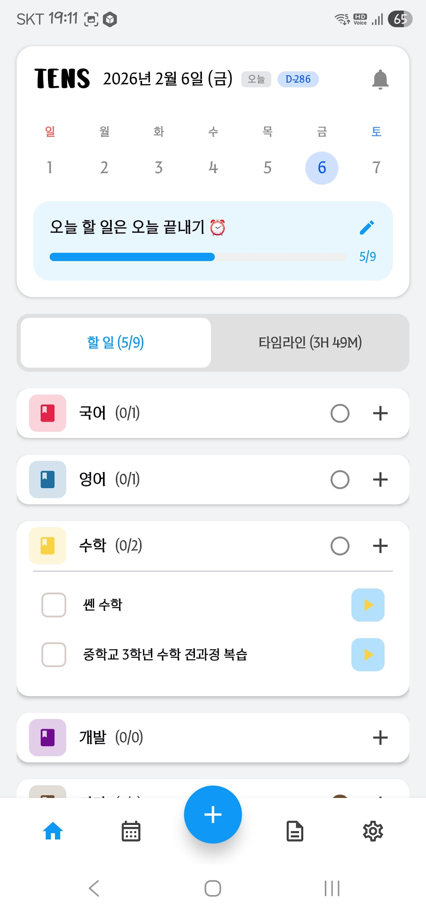 | 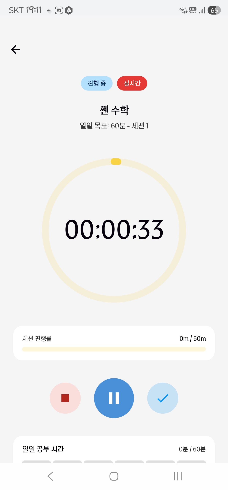 | 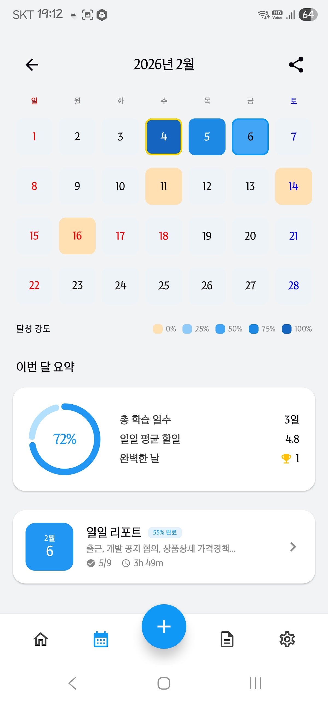 |

- 출처: <https://play.google.com/store/apps/details?id=com.bigroad.tens&hl=ko>
- 스크린샷 출처: 위 스토어 페이지가 게시한 공식 앱 스크린샷

### A3 · 10 MINS PLANNER (웹) — ❓ 오픈소스 여부 확인 불가

"모트모트 스타일 10분 플래너" 로 검색에 잡히는 Vercel 배포 웹앱.
**로그인 벽이라 플래너 화면을 못 봤다.** 계정을 만들지 않았다.

- 출처: <https://planner-swart-zeta.vercel.app/>
- **오픈소스 아님(확인 불가)** — 페이지에 저장소 링크·라이선스 표기가 없고,
  GitHub 검색(`텐미닛 플래너`, `10 minutes planner motemote`, `10분 플래너`)으로도
  대응하는 저장소를 못 찾았다. **코드를 가져올 수 없다고 보는 게 맞다**
- 볼 수 있었던 건 로그인 화면뿐: 크림색 배경(#faf8f5 계열) + 라운드 카드 + 보라 CTA.
  참고할 만한 정보가 없다

---

## B. 유일하게 찾은 오픈소스 10분 격자 구현

### B1 · 10mPlanerwElec — ✅ **MIT**

건축전기설비기술사 수험용으로 개인이 만든 단일 HTML 플래너. 별 0개짜리 개인
프로젝트지만 **10분 격자를 실제로 구현한 것 중 유일하게 라이선스가 붙은 오픈소스**다.
저장소에서 `index.html`(100KB) 받아 로컬에서 렌더한 화면이다:

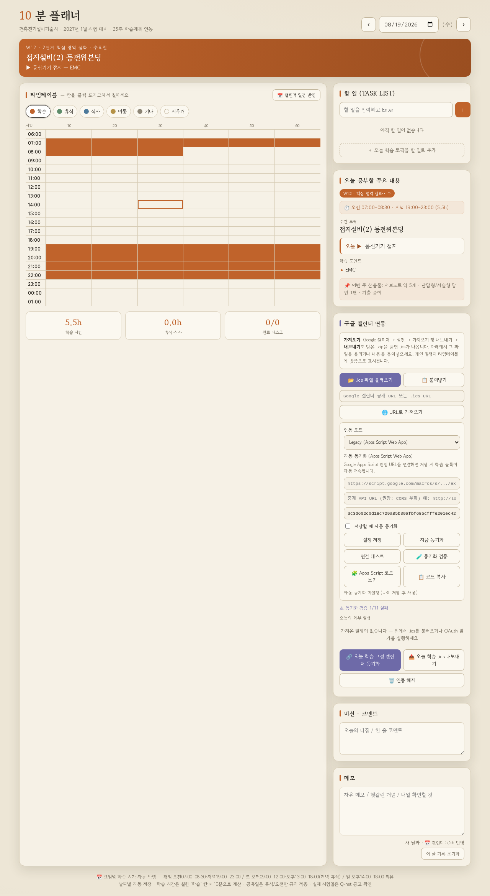

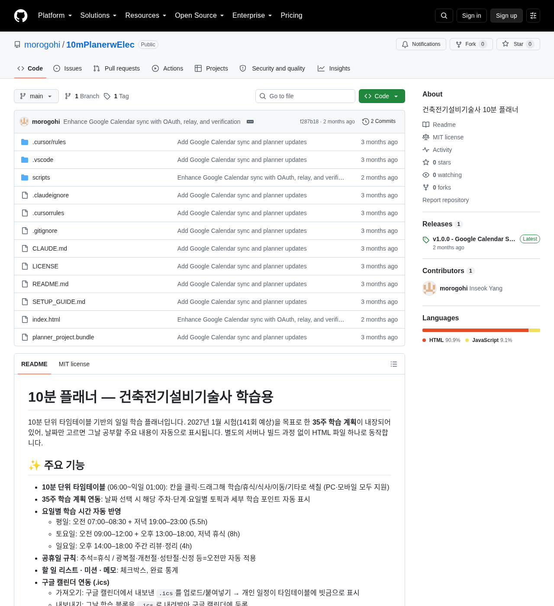

- 출처: <https://github.com/morogohi/10mPlanerwElec>
- 라이선스: **MIT** (`LICENSE` 파일 확인 — GitHub 자동인식은 실패하지만 본문은 표준 MIT)
- GitHub Pages 없음. 위 화면은 저장소의 `index.html` 을 내려받아 직접 렌더한 것

구현이 우리와 겹치는 지점:

| 무엇 | 이 구현 | 우리 |
|---|---|---|
| 격자 | 24행 × 6칸, **열 머리글 `10 20 30 40 50 60`** | 24행 × 6칸, 열 머리글 없음 |
| 하루 시작 | **06:00 시작 → 01:00 끝** | 06:00 시작 → 05:50 끝 |
| 칸 채우기 | 클릭·드래그로 칠함 (`칸을 클릭·드래그해서 칠하세요`) | 자동 수집(ActivityWatch) |
| 카테고리 | 칩 5개 + 지우개 — **학습·휴식·식사·이동·기타** | 활동 9개 + 구조 3개 |
| 현재 칸 | 14:00 행에 **테두리만 있는 칸** = 선택 커서 | NOW 알약(문제 #3) |
| 합계 | 격자 바로 밑 **3개 KPI 타일** (`5.5h 학습시간` / `0.0h 휴식·식사` / `0/0 완료 태스크`) | PNG 에만 있고 웹엔 없음(문제 #9) |
| 레이아웃 | **좌 격자 / 우 사이드바(할 일·요약·메모)** — 1280px 폭을 다 쓴다 | 모바일 우선 그대로(문제 #7) |

> 우리 문제 #7(데스크톱 폭 낭비)·#9(달성률 숫자 없음)에 대한 **가장 값싼 해답**이
> 여기 있다. 격자는 그대로 두고 오른쪽에 칼럼 하나를 붙이면 된다. MIT 라 코드를
> 참고해도 되지만, 이건 개인 수험용이라 **구조만 보고 우리 팔레트로 다시 짜는 게 맞다.**

---

## C. 자동 수집형 시간 시각화 (전부 오픈소스) — 라이선스 주의

우리처럼 **사람이 안 적고 기계가 채우는** 쪽 계보다. 10분 격자는 아니지만
"실측을 어떻게 보여주는가" 는 여기가 훨씬 앞서 있다.

### C1 · ActivityWatch — ✅ **MPL-2.0** (우리가 이미 쓰는 수집기)

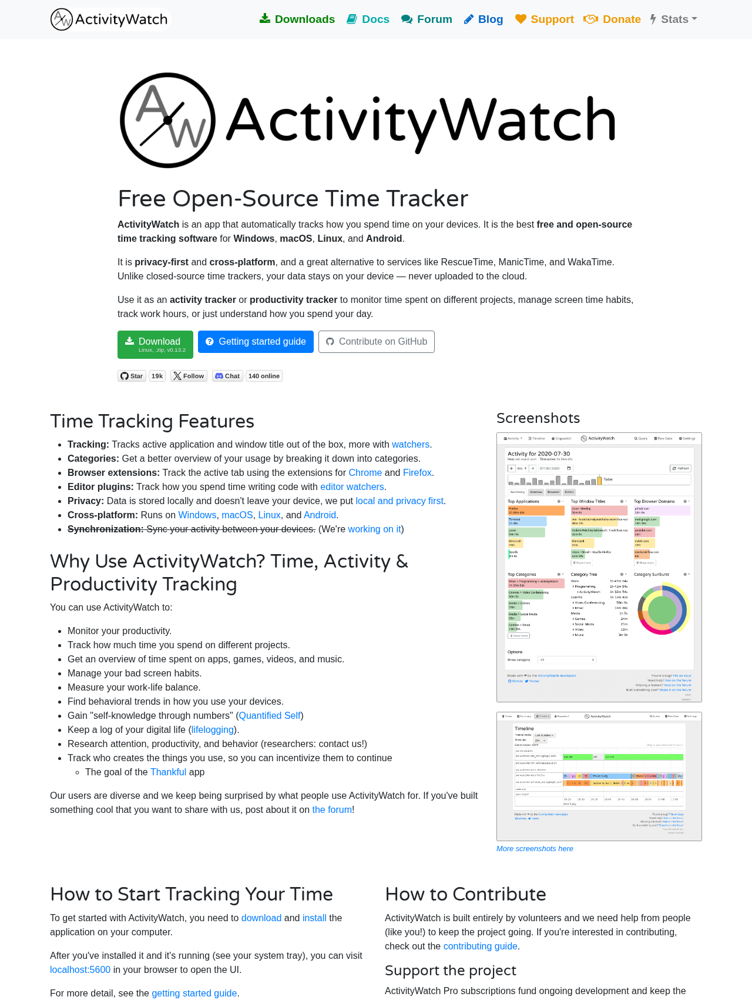

- 출처: <https://activitywatch.net/> · <https://github.com/ActivityWatch/activitywatch> (★18.6k)
- 라이선스: **MPL-2.0** — 파일 단위 카피레프트. 붙여 쓰는 우리 방식은 안전
- 화면상 참고점: 하루를 **가로 24시간 띠**로 눌러 놓고 그 아래에 Top Applications /
  Top Categories / Category Sunburst 를 붙인다. 우리 시안 B 의 "머리글 24시간 요약 띠" 와 같은 발상
- **주의**: 이 대시보드는 "무엇을 얼마나" 만 보여주고 **의도(계획)가 없다.**
  우리는 계획 대비 실측이 핵심이라 이 레이아웃을 그대로 가져오면 절반을 잃는다

### C2 · Dayflow — ✅ **MIT** (가장 최근에 뜬 것, ★6.9k)

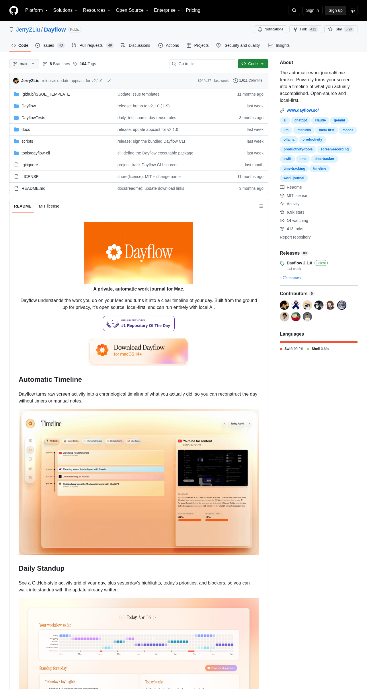

- 출처: <https://github.com/JerryZLiu/Dayflow> · <https://www.dayflow.so/>
- 라이선스: **MIT** — 코드 참고·차용 가능
- macOS 전용(Swift 99.2%)이라 코드를 직접 쓸 일은 없지만 **화면 설계가 우리와 가장 가깝다**:
  화면 활동을 LLM 이 요약해 "실제로 무엇을 했는지" 타임라인으로 만든다. 우리 야간 배치와 같은 구조
- 참고점 2가지:
  1. **타임라인 항목 = 시각 + 아이콘 + 한 문장.** 격자가 아니라 문장으로 읽힌다
     (시안 C 의 "레일 + 피드" 와 같은 방향)
  2. **Daily Standup** 화면의 GitHub 잔디형 활동 격자 — 카테고리별 가로 줄 × 시간 축.
     시안 B 의 "계획 레인 | 실측 레인" 을 카테고리 수만큼 늘린 형태

### C3 · TimeTagger — ✅ **GPL-3.0** ⚠️ 코드 차용 금지

라이브 데모가 열려 있어 **실제 동작 화면**을 잡았다 (5년치 랜덤 데이터):

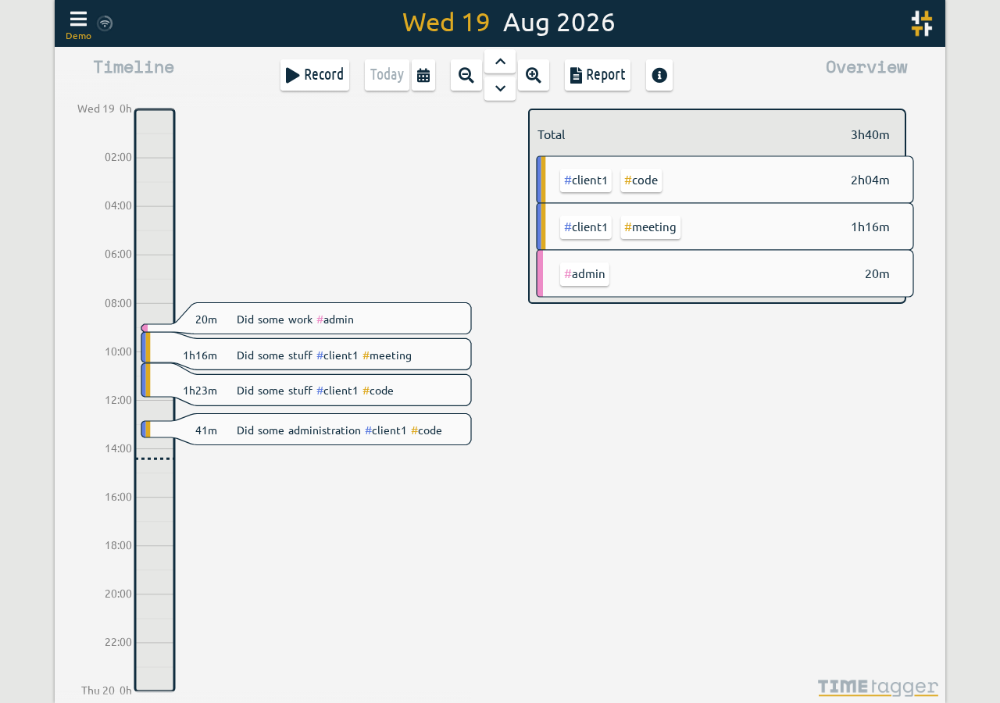

- 출처: <https://timetagger.app/demo> · <https://github.com/almarklein/timetagger>
- 라이선스: **GPL-3.0** — **코드를 가져오면 우리 전체가 GPL 이 된다. 보기만 한다**
- 참고점: **세로 24시간 눈금자 + 그 오른쪽에 블록**. 블록은 시간 길이에 비례하고
  라벨(`1h16m  Did some administration  #client1 #meeting`)이 블록 밖에 붙는다.
  → 시안 B 가 "블록을 시간 길이에 비례" 시킨 것과 같은 처리. 다만 **비례 블록은
  10분짜리가 글자 높이보다 얇아진다** — 데모에서도 20분짜리는 라벨이 겨우 들어간다.
  우리 10분 슬롯에 그대로 쓰면 못 읽는다는 실증
- 눈금자에 `Wed 19 0h` ~ `Thu 20 0h` 로 **날짜 경계를 명시**한다. 우리 06:00 경계 표기에 참고

### C4 · solidtime — ✅ **AGPL-3.0** ⚠️ 코드 차용 금지

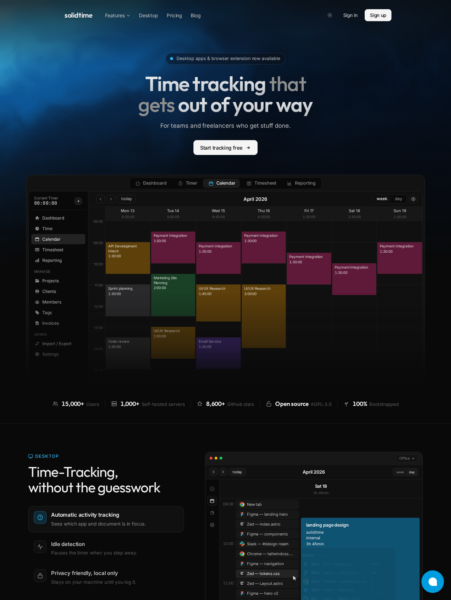

- 출처: <https://solidtime.io/> · <https://github.com/solidtime-io/solidtime> (★8.9k)
- 라이선스: **AGPL-3.0** — 네트워크 제공만 해도 공개 의무. **참고만**
- 참고 가치는 시각화보다 **화면 밀도·타이포**다. 팀 청구용이라 우리 개인 로그와 목적이 다르다

### C5 · Kimai — ✅ **AGPL-3.0** ⚠️ 코드 차용 금지

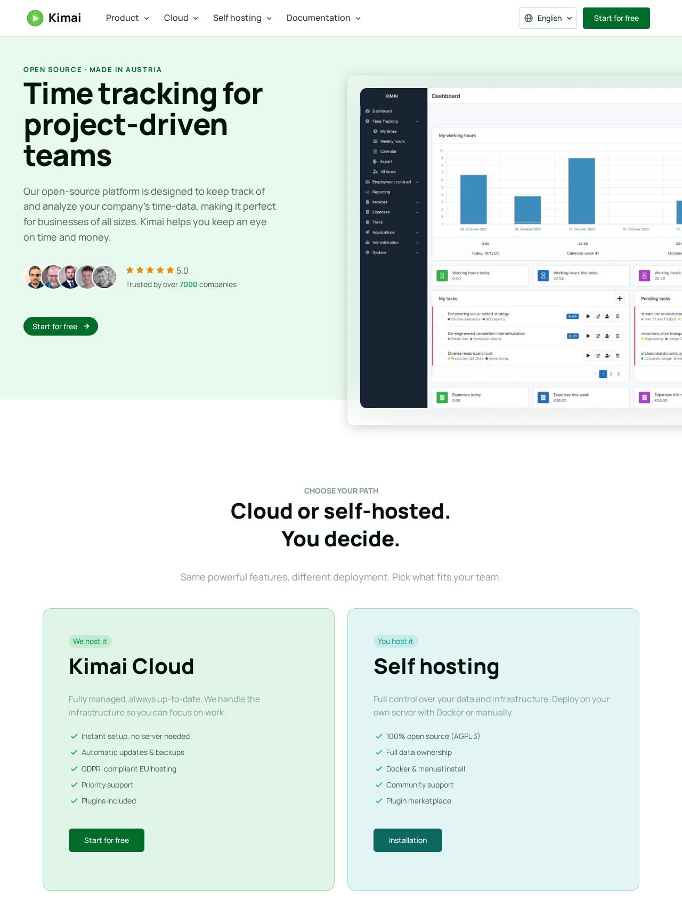

- 출처: <https://www.kimai.org/> · <https://github.com/kimai/kimai> (★4.9k)
- 라이선스: **AGPL-3.0**
- 근무시간표/청구서 쪽이라 우리와 거리가 가장 멀다. **목록에는 두되 우선순위 최하**

### C6 · Super Productivity — ✅ **MIT**

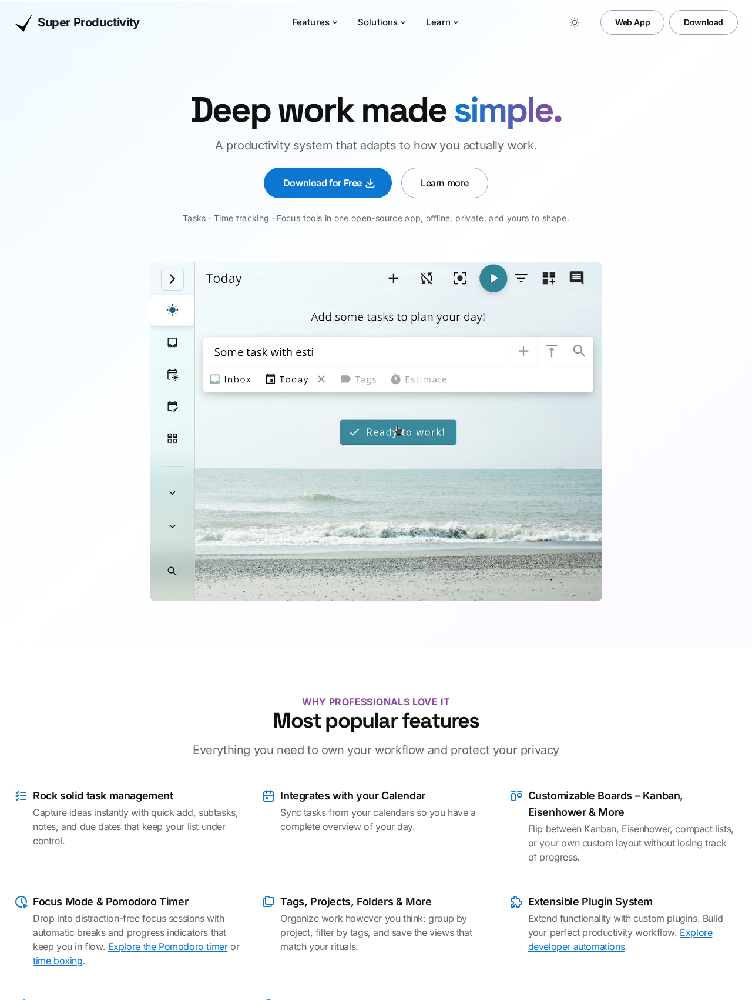

- 출처: <https://super-productivity.com/> · <https://github.com/super-productivity/super-productivity> (★21.4k)
- 라이선스: **MIT** — 차용 가능
- 참고점: 할 일 목록과 타임박싱/시간추적이 **한 화면에 붙어 있다.**
  우리 "계획 목록 + 격자" 배치의 선례

---

## D. 종이 플래너 계보 — 인쇄물 생성기

우리 PNG 렌더러(`report/planner.py`)와 목적이 같은 쪽이다. **HTML→PNG 검토
([../../README.md](../../README.md) §2)에 직접 걸린다.**

### D1 · Emergent Task Planner (ETP) — ❌ 오픈소스 아님 (개인 사용 무료)

2006년부터 20년간 다듬어진 종이 데일리 플래너. 10분이 아니라 **15분 버블**이다.

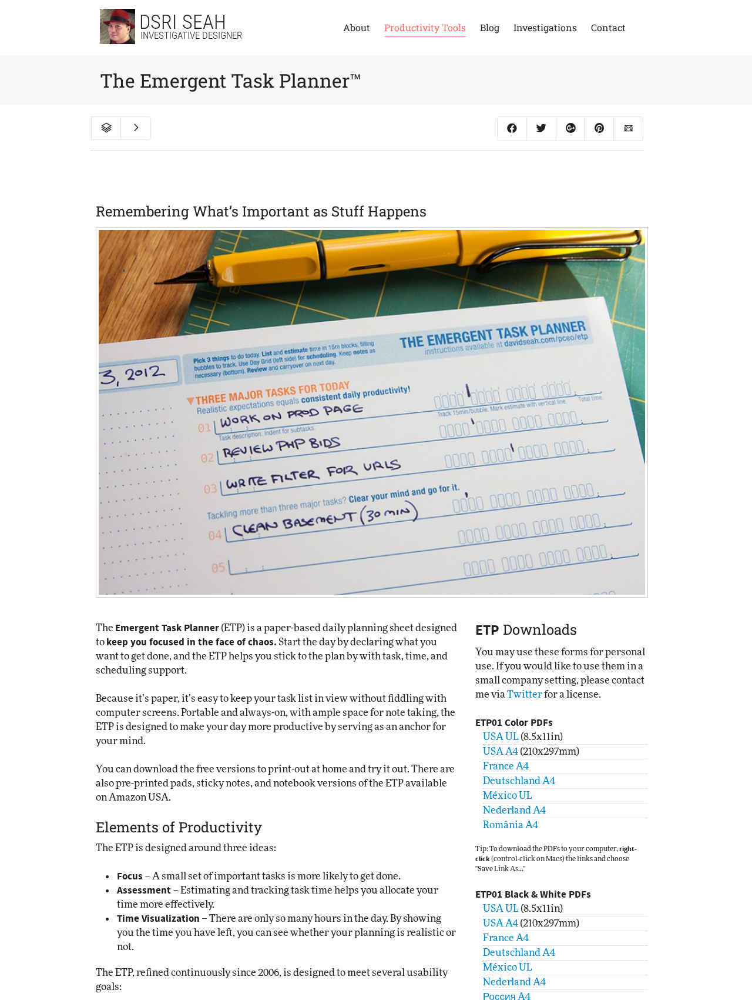

- 출처: <https://davidseah.com/node/the-emergent-task-planner/>
- 라이선스: **오픈소스 아님.** 페이지 원문 —
  "*You may use these forms for personal use. If you would like to use them in a
  small company setting, please contact me via Twitter for a license.*"
  → **개인 사용만 무료, 상업적 사용은 개별 라이선스.** 이름도 ™ 표기
- 설계 원칙 3개를 스스로 밝혀 놨는데 우리에게 그대로 유효하다:
  **Focus**(중요한 일은 적게) / **Assessment**(시간 추정과 실측을 같이) /
  **Time Visualization**(남은 시간을 보여줘야 계획이 현실적인지 안다)
- 형식 참고: 왼쪽 세로 시간 눈금 + 오른쪽 태스크 목록, 각 태스크마다
  **15분짜리 버블을 채워** 소요를 기록한다. 세로 막대로 *추정*을 표시하고
  버블 채움이 *실측* 이다 → **계획과 실측을 한 줄에 겹쳐 놓은 종이 해법**.
  우리 시안 A 의 "항목 밑줄이 채워진다" 와 같은 발상

### D2 · reMarkable Daily Planner Generator — ✅ **MIT**

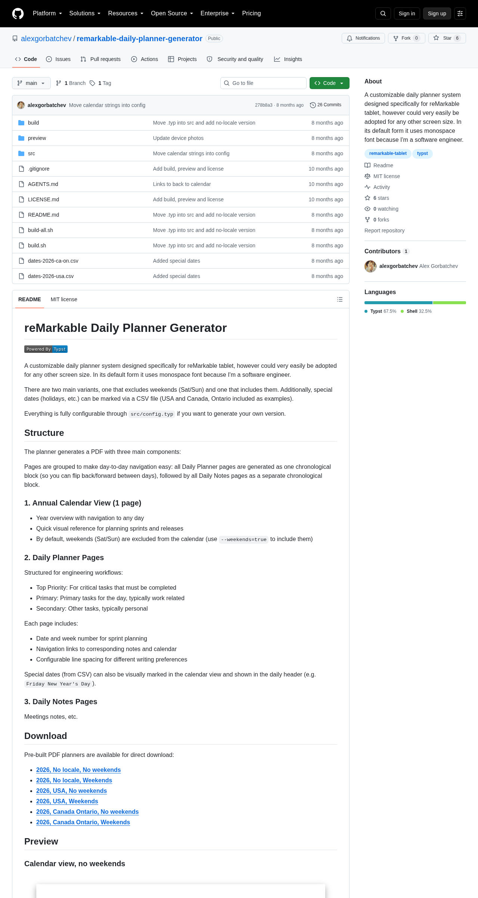

- 출처: <https://github.com/alexgorbatchev/remarkable-daily-planner-generator>
- 라이선스: **MIT**
- **Typst 로 PDF 를 생성**한다(Typst 67.5% / Shell 32.5%). 설정은 `src/config.typ` 한 파일
- 우리에게 걸리는 지점: **"설정 파일 하나에서 지면을 생성" 이라는 구조**가
  우리 `palette.yaml` 단일 원본 규칙과 같다. HTML→PNG 대신 **Typst→PNG** 도
  선택지라는 것 (다만 의존성이 하나 더 늘어난다 — 우리 메모리 예산에서 따져야 한다)

### D3 · digital-planner-generator — ✅ **MIT**

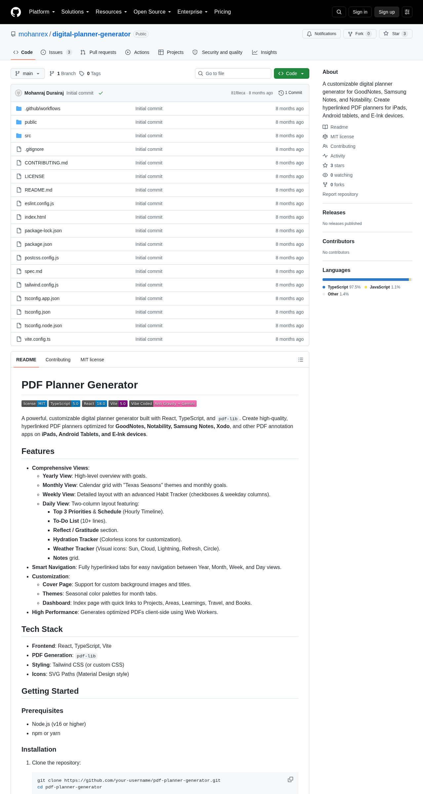

- 출처: <https://github.com/mohanrex/digital-planner-generator>
- 라이선스: **MIT** (`LICENSE` 파일 직접 확인. GitHub 자동인식만 실패한 상태)
- GoodNotes/Samsung Notes 용 **하이퍼링크 PDF** 생성기. 일간 페이지에 hourly timeline 포함
- 참고 가치는 낮다(★3). 목록 완결성 때문에 남긴다

### D4 · remarkable-daily-planner — ⚠️ 소스 공개, **라이선스 없음**

- 출처: <https://github.com/vikboyechko/remarkable-daily-planner> (★14)
- **`LICENSE` 파일이 없다.** 소스가 보인다고 쓸 수 있는 게 아니다 — 기본 저작권이라
  복제·수정 권리가 없다. **코드 차용 금지, 화면 참고만**
- iCal(Google Calendar/Outlook) 일정을 끌어와 PDF 데일리를 만든다

---

## 2. 이 조사가 우리 시안 3종에 주는 답

| 현행 문제 | 레퍼런스가 이미 푼 방식 | 어디서 |
|---|---|---|
| #3 NOW 알약이 데이터를 가린다 | **행 안쪽 가는 세로선**(빨강). 칸을 안 가린다 | A2 TENS |
| #4 10분 칸 144개가 따로 논다 | 10분 경계는 **옅은 점선**, 시간 경계만 실선 + 연속 칠하기 | A1 모트모트 |
| #5 자리비움이 활동처럼 보인다 | 구조 상태는 색이 아니라 **가로 실선 + 글자**(`점심`,`낮잠`) | A1 모트모트 |
| #6 범례가 항상 9개 | 그날 쓴 것만. 실사용은 **4~6색**이면 충분했다 | A1, A2 |
| #7 데스크톱 폭을 안 쓴다 | **좌 격자 / 우 사이드바** 2단 | B1 오픈소스 |
| #9 달성률이 막대뿐 | 격자 밑 **KPI 타일 3개** / 탭 라벨에 `(3H 49M)` | B1, A2 |
| (신규) 10분 칸이 몇 분인지 안 보인다 | 상단 **열 머리글 `10 20 30 40 50 60`** | A2, B1 |

**계획 대비 실측 표현**은 A2(TENS)가 이미 답을 냈다 — **계획 = 점선 테두리, 실측 = 채움,
같은 격자 위에 겹침.** 우리 계약서 §5 와 같은 규칙이고, 시안 B 처럼 레인을 둘로 쪼개지
않아도 된다는 뜻이다. **시안 B 의 2레인은 화면을 두 배 먹는 대가로 얻는 게 크지 않을 수 있다.**

**비례 블록(시안 B)의 위험**은 C3(TimeTagger) 데모가 실증한다 — 20분짜리 블록도 라벨이
겨우 들어간다. 10분 슬롯을 시간 비례로 그리면 못 읽는다.

---

## 3. 수집 방법 (재현용)

Playwright(번들 Chromium, headless, 1280px, ko-KR)로 직접 접속해 캡처했다.
스크립트는 남기지 않았다 — 일회성 조사다.

- `shots/1x-*` 모트모트 (상품 페이지 + 상세 이미지에서 잘라냄)
- `shots/2x-*` TENS (스토어 페이지 + 스토어가 게시한 공식 앱 스크린샷)
- `shots/3x-*` 오픈소스 10분 플래너 (저장소 `index.html` 을 받아 로컬 렌더)
- `shots/4x-*` 자동 수집형 (공식 사이트 / GitHub / 라이브 데모)
- `shots/5x-*` 종이 플래너 생성기

**모든 스크린샷은 내부 설계 참고용이다.** 각 이미지의 저작권은 원 출처에 있고
우리 산출물에 재배포하지 않는다.
